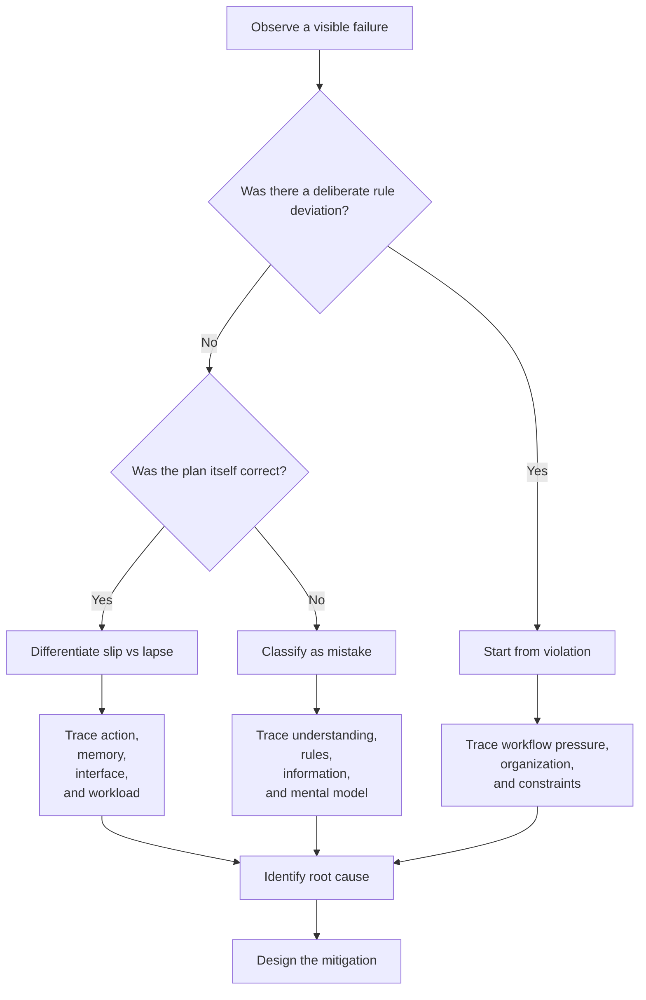

# Human Error Frameworks

This chapter focuses on two questions: why people make errors and why error analysis cannot stop at the individual who happened to fail.

!!! note "Core Question"
    Why do people make errors,
    why can we not simply blame the individual,
    and how does this framework help us identify what should actually be fixed?

## Key Takeaways

- People making errors does not mean the whole problem sits inside the person.
- `slip`,
  `lapse`,
  `mistake`,
  and `violation` all look like failure,
  but they are not the same type of failure.
- The goal of classification is not labeling;
  it is finding root cause and mitigation.
- The same surface error may emerge from perception,
  cognition,
  or action failure.
- If analysis stops at who failed,
  the larger system causes are usually missed.

## Remember This First

!!! tip "Keep This Sentence in Mind"
    People do not err simply because they are “bad operators.” Attention,
    memory,
    and judgment all have limits,
    and poor design,
    unclear information,
    and weak workflows magnify those limits into visible failure.
    
    This page therefore answers a single question:
    how should we read an error if we actually want to improve the system?

## What Counts as Human Error

In plain language,
`human error` means a person intended to do the task correctly but failed to produce the intended result.

Two parts matter:

- the person was trying to do the task correctly, so the framework begins with unintended deviation
- the problem may sit in action, sequence, timing, or judgment rather than only in the final outcome

The two course definitions are enough to carry forward:

- `Reason (1990)`: a planned mental or physical activity fails to achieve the intended result
- `Hagen & Mays (1981)`: the action fails under constraints such as `accuracy`, `sequence`, or `time`

!!! note "One-Sentence Conclusion"
    Human error is not mainly a blame term;
    it is an analytic term.
    Its value lies in separating wrong action,
    omitted action,
    wrong judgment,
    and system-created error opportunity.

## Why We Cannot Stop at Blaming the Person

If analysis starts with “the whole problem is inside the person,” every later category becomes a more refined version of blame.

That is why the lecture connects `old view / new view`,
`internal / external`,
and `sharp end / blunt end` in one line:

- `old view`: the system is basically fine and failure mainly reflects operator carelessness or weakness
- `new view`: people do err, but the deeper question is why the system made the error easy to produce or hard to stop
- `internal`: limits of attention, memory, fatigue, and judgment
- `external`: interface, instructions, environment, workload, and organizational pressure
- `sharp end`: the visible frontline action
- `blunt end`: the upstream design, policy, resource, and organizational decisions

<figure class="note-inline-figure">
  
  <figcaption>The point of this figure is not that some people are “bad apples,” but that once the system is presumed healthy, analysis slides automatically toward blame instead of redesign.</figcaption>
</figure>

!!! note "The Main Conclusion of This Section"
    The visible failure may belong to the person,
    but the deeper vulnerability often belongs to the system creating error-prone conditions.

!!! example "Example: Why the Wrong-Medication Event Cannot Stop at Blaming the Nurse"
    A hospital stores two look-alike medications next to each other.
    Nothing happens for a while,
    until a fatigued nurse selects the wrong one during a shift and the patient is harmed.
    The shallow summary is “the nurse picked the wrong drug.” The better questions are why the medications were stored together,
    why the packaging was so confusable,
    why a fatigued operator had to perform the high-risk discrimination,
    and why stronger checks failed to intercept the error.

## How to Distinguish the Four Error Types

Once the analysis stops blaming the person,
the next step is classification.
Classification matters because different failure types require different fixes.

### 1. `slip`
The plan is correct,
but the action execution goes wrong.
Typical example:
intending to press A but touching B.

### 2. `lapse`
The plan is correct,
but the needed action never happens.
Typical example:
omitting a check or forgetting a confirmation.

### 3. `mistake`
Execution is smooth,
but the understanding,
judgment,
or plan is wrong from the start.
Typical example:
consistently acting on the wrong interpretation.

### 4. `violation`
The rule is known,
but the operator deliberately departs from it.
Typical example:
skipping a step to save time.

The shortest memory line is:

- `slip`: the intention was right, the hand was wrong
- `lapse`: the intention was right, but the action was omitted
- `mistake`: the execution was consistent, but the plan was wrong
- `violation`: the rule was known, but deliberately bypassed

<figure class="note-inline-figure">
  
  <figcaption>This figure should make one point visible: slip, lapse, mistake, and violation all look like failure on the surface, but they occur at different layers and should not trigger the same fix.</figcaption>
</figure>

!!! warning "The Most Common Confusions"
    - `slip` is not not knowing what to do;
      it is knowing what to do and still deviating during execution.
    - `lapse` is not a wrong action;
      it is an omitted action,
      usually tied to memory or attention dropout.
    - `mistake` can look smooth because execution itself may be consistent;
      the problem sits earlier in rule use or mental model.
    - `violation` carries intent,
      so it differs from the other three,
      but that does not mean the analysis ends there.

!!! example "Four Mini Cases"
    - `slip`:
      a nurse intends to press “silence alarm” but hits “stop infusion” instead.
    - `lapse`:
      the operator knows a double-check is required but moves on after the previous task and omits it entirely.
    - `mistake`:
      a physician interprets the situation incorrectly and then acts consistently on that wrong understanding.
    - `violation`:
      an operator knows scanning is required but skips it during a rush.

## Why the PCA Model Matters

The previous section answers “what kind of error is this?” The PCA model asks a deeper question:
where did the problem start to grow?

`PCA` stands for `Perception - Cognition - Action`:

- `Perception`: was the critical cue seen, heard, or sensed?
- `Cognition`: was it understood, remembered, and judged correctly?
- `Action`: was the final action executed correctly?

That matters because the same surface failure can have completely different roots.

| Surface failure | Where the deeper problem may sit | Better design response |
| --- | --- | --- |
| pressing the wrong button | `Action`: the button was known, but execution slipped | change spacing, guards, and feedback |
| missing a hidden button | `Perception`: the cue was not seen or noticed | change visibility, salience, and contrast |
| releasing a syringe too early | `Cognition`: the user remembered or understood the rule incorrectly | change instructions, timing feedback, and task guidance |

<figure class="note-inline-figure">
  
  <figcaption>This figure should make clear that the same surface failure may come from perception, cognition, or action, which means root cause and mitigation will also differ.</figcaption>
</figure>

!!! note "The Main Conclusion of This Section"
    The value of PCA is not the acronym itself.
    It is the reminder not to stare only at the final action,
    but to ask where the error started to develop.

!!! example "Example: The Same Early Injection Stop Can Have Different Roots"
    - If the finger slips unintentionally,
      the root is closer to `Action`.
    - If the user wrongly perceives that the plunger is already fully depressed,
      the root is closer to `Perception`.
    - If the user remembers “hold for 10 seconds” as “hold for 6 seconds,” the root is closer to `Cognition`.

## How to Use the Framework

When analyzing a real event,
walk the framework in order:



The practical point is simple:
do not jump straight to “more training.” Classify first,
trace the deeper cause second,
and only then decide whether the right response is interface change,
workflow change,
prompting,
documentation,
or organizational redesign.

## Chapter Summary

!!! tip "What To Carry Forward"
    - Human error analysis is about why failure happened,
      not about who is “bad.”
    - Stopping at the failing individual usually misses the larger system causes.
    - `slip`,
      `lapse`,
      `mistake`,
      and `violation` must be separated because they lead to different mitigations.
    - The `old view` compresses failure into blame;
      the `new view` asks how the system created or amplified the risk.
    - The PCA model reminds us that the same surface error may begin in perception,
      cognition,
      or action.
    - Classification is only useful if it leads to better root-cause analysis and mitigation.


## Source Scope and Related Topics

The teaching notes come first. This section lists the source files used on the page, and the appendix keeps the full line-by-line transcription for verification.

- Section: `ENP111 Use-related Risks`
- Source files: 2
- Text units: 443
- Visuals/previews: 14

| Source | Type | Text Units | Visuals | Download |
| --- | --- | ---: | ---: | --- |
| `02 Intro to Human Error (1).pptx` | `pptx` | 234 | 12 | [open](../assets/source_files/ENP111/02 Intro to Human Error (1).pptx) |
| `03 HE Frameworks (2).pptx` | `pptx` | 209 | 2 | [open](../assets/source_files/ENP111/03 HE Frameworks (2).pptx) |

## Related Topics

- [Introduction to Human Factors](human_factors_intro.en.md)
- [The Swiss Cheese Model](swiss_cheese.en.md)
- [Error Analysis and Investigation Flow](../ENP112/error_analysis_methods.en.md)

## Original Transcription and Coverage Mapping

The collapsible blocks below preserve page/slide-level source transcription. Each `unit_id` maps one-to-one in `data/coverage_map.json`.

??? info "02 Intro to Human Error (1).pptx | 234 text units"
    Download source: [02 Intro to Human Error (1).pptx](../assets/source_files/ENP111/02 Intro to Human Error (1).pptx)
    Mapped page: `human_error_frameworks`
    
    ```text
    [02-intro-to-human-error-1-0001] slide:1:p:1 | Sami Durrani PhD and Eric Bergman PhD
    [02-intro-to-human-error-1-0002] slide:1:p:2 | Introduction to Human Error
    [02-intro-to-human-error-1-0003] slide:2:p:1 | To err is human…” (Cicero, BC)
    [02-intro-to-human-error-1-0004] slide:2:p:2 | “The only real mistake is the one from which we learn nothing” (Attributed to Henry Ford)
    [02-intro-to-human-error-1-0005] slide:2:p:3 | “… to understand the reasons why humans err is science” (Hollnagel, 1993)
    [02-intro-to-human-error-1-0006] slide:2:p:4 | What is Human Error
    [02-intro-to-human-error-1-0007] slide:3:p:1 | Error will be taken as a generic term to encompass all those occasions in which a planned sequence of mental or physical activities fails to achieve its intended outcome, and when these failures cannot be attributed to the intervention of some change agency. (Reason, 1990)
    [02-intro-to-human-error-1-0008] slide:3:p:2 | Definitions
    [02-intro-to-human-error-1-0009] slide:4:p:1 | A failure on the part of the human to perform a prescribed act (or the performance of a prohibited act) within specified limits of
    [02-intro-to-human-error-1-0010] slide:4:p:2 | accuracy,
    [02-intro-to-human-error-1-0011] slide:4:p:3 | sequence,
    [02-intro-to-human-error-1-0012] slide:4:p:4 | or time.
    [02-intro-to-human-error-1-0013] slide:4:p:5 | (Hagen & Mays, 1981)
    [02-intro-to-human-error-1-0014] slide:4:p:6 | Definitions
    [02-intro-to-human-error-1-0015] slide:5:p:1 | but, is it that clear-cut?
    [02-intro-to-human-error-1-0016] slide:6:p:1 | I will speak out 20 words
    [02-intro-to-human-error-1-0017] slide:6:p:2 | Do not write anything until I have finished.
    [02-intro-to-human-error-1-0018] slide:6:p:3 | Write as many words as you can remember, regardless of order.
    [02-intro-to-human-error-1-0019] slide:6:p:4 | Do not guess!
    [02-intro-to-human-error-1-0020] slide:6:p:5 | Memory Experiment
    [02-intro-to-human-error-1-0021] slide:7:p:1 | North
    [02-intro-to-human-error-1-0022] slide:7:p:2 | apple
    [02-intro-to-human-error-1-0023] slide:7:p:3 | John
    [02-intro-to-human-error-1-0024] slide:7:p:4 | red
    [02-intro-to-human-error-1-0025] slide:7:p:5 | dime
    [02-intro-to-human-error-1-0026] slide:7:p:6 | pear
    [02-intro-to-human-error-1-0027] slide:7:p:7 | Bill
    [02-intro-to-human-error-1-0028] slide:7:p:8 | blue
    [02-intro-to-human-error-1-0029] slide:7:p:9 | quarter
    [02-intro-to-human-error-1-0030] slide:7:p:10 | West
    [02-intro-to-human-error-1-0031] slide:7:p:11 | Memory Experiment
    [02-intro-to-human-error-1-0032] slide:7:p:12 | grape
    [02-intro-to-human-error-1-0033] slide:7:p:13 | nickel
    [02-intro-to-human-error-1-0034] slide:7:p:14 | yellow
    [02-intro-to-human-error-1-0035] slide:7:p:15 | East
    [02-intro-to-human-error-1-0036] slide:7:p:16 | green
    [02-intro-to-human-error-1-0037] slide:7:p:17 | Robert
    [02-intro-to-human-error-1-0038] slide:7:p:18 | banana
    [02-intro-to-human-error-1-0039] slide:7:p:19 | Charlie
    [02-intro-to-human-error-1-0040] slide:7:p:20 | Dollar
    [02-intro-to-human-error-1-0041] slide:7:p:21 | South
    [02-intro-to-human-error-1-0042] slide:8:p:1 | I will speak out 20 more words.
    [02-intro-to-human-error-1-0043] slide:8:p:2 | Do not write anything until I have finished.
    [02-intro-to-human-error-1-0044] slide:8:p:3 | Write as many words as you can remember, regardless of order. Do not guess!
    [02-intro-to-human-error-1-0045] slide:8:p:4 | This time, before you write the words, start at the number 18 and count backwards in intervals of threes out loud as rapidly as possible, so you'll start at 18, then the next is 15, and so on.
    [02-intro-to-human-error-1-0046] slide:8:p:5 | Memory Experiment 2
    [02-intro-to-human-error-1-0047] slide:9:p:1 | time
    [02-intro-to-human-error-1-0048] slide:9:p:2 | stab
    [02-intro-to-human-error-1-0049] slide:9:p:3 | solve
    [02-intro-to-human-error-1-0050] slide:9:p:4 | house
    [02-intro-to-human-error-1-0051] slide:9:p:5 | mutt
    [02-intro-to-human-error-1-0052] slide:9:p:6 | draft
    [02-intro-to-human-error-1-0053] slide:9:p:7 | say
    [02-intro-to-human-error-1-0054] slide:9:p:8 | off
    [02-intro-to-human-error-1-0055] slide:9:p:9 | Royal
    [02-intro-to-human-error-1-0056] slide:9:p:10 | slot
    [02-intro-to-human-error-1-0057] slide:9:p:11 | Memory Experiment
    [02-intro-to-human-error-1-0058] slide:9:p:12 | Hand
    [02-intro-to-human-error-1-0059] slide:9:p:13 | Dirt
    [02-intro-to-human-error-1-0060] slide:9:p:14 | Plot
    [02-intro-to-human-error-1-0061] slide:9:p:15 | Court
    [02-intro-to-human-error-1-0062] slide:9:p:16 | Out
    [02-intro-to-human-error-1-0063] slide:9:p:17 | Greet
    [02-intro-to-human-error-1-0064] slide:9:p:18 | Dent
    [02-intro-to-human-error-1-0065] slide:9:p:19 | Stale
    [02-intro-to-human-error-1-0066] slide:9:p:20 | Stone
    [02-intro-to-human-error-1-0067] slide:9:p:21 | dice
    [02-intro-to-human-error-1-0068] slide:10:p:1 | Is it an error that you can’t remember 20 words?
    [02-intro-to-human-error-1-0069] slide:11:p:1 | Old View (aka Rotten Apple Theory)
    [02-intro-to-human-error-1-0070] slide:11:p:2 | People are the cause of the problem
    [02-intro-to-human-error-1-0071] slide:11:p:3 | The system is good, but the human is faulty
    [02-intro-to-human-error-1-0072] slide:11:p:4 | Solve the problems by firing  or “fixing” the bad apple
    [02-intro-to-human-error-1-0073] slide:11:p:5 | New View
    [02-intro-to-human-error-1-0074] slide:11:p:6 | Errors are a result of a problematic system
    [02-intro-to-human-error-1-0075] slide:11:p:7 | Solve the problem by fixing the system
    [02-intro-to-human-error-1-0076] slide:11:p:8 | Errors are inevitable, so empower humans/systems to prevent or mitigate
    [02-intro-to-human-error-1-0077] slide:11:p:9 | Two Views of Human Error
    [02-intro-to-human-error-1-0078] slide:12:p:1 | 12
    [02-intro-to-human-error-1-0079] slide:12:p:2 | Human Errors are Internal:
    [02-intro-to-human-error-1-0080] slide:12:p:3 | Cognitive Limitations: Every human has cognitive boundaries. Memory lapses, attention deficits, misjudgments, and misperceptions are inherently internal. For instance, forgetting a step in a procedure or misunderstanding instructions is rooted in our cognitive processes.
    [02-intro-to-human-error-1-0081] slide:12:p:4 | Emotional Factors: Emotions can significantly influence decision-making and actions. Stress, anxiety, overconfidence, or complacency are internal states that can lead to errors.
    [02-intro-to-human-error-1-0082] slide:12:p:5 | Physical Limitations: Fatigue, decreased reaction time, and other physiological states can cause errors. A tired pilot or a sleep-deprived surgeon is more likely to make mistakes due to their internal physical state.
    [02-intro-to-human-error-1-0083] slide:12:p:6 | Decision-making Biases: Cognitive biases like confirmation bias, overconfidence bias, and availability heuristic are internal mental shortcuts that can lead to erroneous decisions.
    [02-intro-to-human-error-1-0084] slide:12:p:7 | Are Errors truly “human”: Internal vs External
    [02-intro-to-human-error-1-0085] slide:13:p:1 | 13
    [02-intro-to-human-error-1-0086] slide:13:p:2 | Human Errors are External:
    [02-intro-to-human-error-1-0087] slide:13:p:3 | System Design Flaws: Poorly designed systems, tools, or procedures can set individuals up for failure. For instance, if a piece of equipment is designed unintuitively, users might make mistakes while operating it.
    [02-intro-to-human-error-1-0088] slide:13:p:4 | Environmentally Induced: External factors like lighting, noise, temperature, or other environmental conditions can contribute to errors. For instance, a worker in a loud environment might mishear instructions.
    [02-intro-to-human-error-1-0089] slide:13:p:5 | Training and Guidance: Lack of proper training or guidance is an external factor. If a person is not given the right information or skills to perform a task, they are more likely to err.
    [02-intro-to-human-error-1-0090] slide:13:p:6 | Organizational Culture: A culture that does not prioritize safety, rushes tasks, or does not provide adequate resources creates an environment ripe for errors.
    [02-intro-to-human-error-1-0091] slide:13:p:7 | External Pressures: Deadlines, societal expectations, peer pressure, or even customer demands can push individuals to make hurried decisions or skip safety protocols, leading to errors.
    [02-intro-to-human-error-1-0092] slide:13:p:8 | Ambiguous Information: Externally provided information that is unclear or ambiguous can lead individuals to make wrong decisions or take incorrect actions.
    [02-intro-to-human-error-1-0093] slide:13:p:9 | Are Errors truly “human”: Internal vs External
    [02-intro-to-human-error-1-0094] slide:14:p:1 | The Blunt and Sharp Ends
    [02-intro-to-human-error-1-0095] slide:14:p:2 | Latent Errors: Hidden mistakes embedded in systems, often introduced by designers, engineers, policy decision makers
    [02-intro-to-human-error-1-0096] slide:14:p:3 | Active Errors: These are direct mistakes, often made by frontline operators, and their effects are immediately apparent.
    [02-intro-to-human-error-1-0097] slide:15:p:1 | Slips (errors of commission)
    [02-intro-to-human-error-1-0098] slide:15:p:2 | Actions not carried out as intended
    [02-intro-to-human-error-1-0099] slide:15:p:3 | “Correct plan, incorrect action”
    [02-intro-to-human-error-1-0100] slide:15:p:4 | Typically happen during highly routine tasks
    [02-intro-to-human-error-1-0101] slide:15:p:5 | e.g., foot slipping off a pedal, typos
    [02-intro-to-human-error-1-0102] slide:15:p:6 | Lapses (errors of omission)
    [02-intro-to-human-error-1-0103] slide:15:p:7 | Actions not carried out as intended due to memory or attention
    [02-intro-to-human-error-1-0104] slide:15:p:8 | “Correct plan, action not taken”
    [02-intro-to-human-error-1-0105] slide:15:p:9 | e.g., Forgetting to set an alarm
    [02-intro-to-human-error-1-0106] slide:15:p:10 | Mistakes
    [02-intro-to-human-error-1-0107] slide:15:p:11 | Proper execution of a faulty plan
    [02-intro-to-human-error-1-0108] slide:15:p:12 | “Incorrect plan or assessments, corresponding action”
    [02-intro-to-human-error-1-0109] slide:15:p:13 | e.g., incorrect medical diagnosis
    [02-intro-to-human-error-1-0110] slide:15:p:14 | Error Types
    [02-intro-to-human-error-1-0111] slide:16:p:1 | 16
    [02-intro-to-human-error-1-0112] slide:16:p:2 | Types of Unsafe Acts (James Reason)
    [02-intro-to-human-error-1-0113] slide:16:p:3 | Adapted from James Reason, Human Error, Cambridge University Press, 1991.
    [02-intro-to-human-error-1-0114] slide:17:p:1 | Malicious Compliance or Intentional Non-Compliance ≠ Error
    [02-intro-to-human-error-1-0115] slide:17:p:2 | Bonus:
    [02-intro-to-human-error-1-0116] slide:17:p:3 | /r/MaliciousCompliance Subreddit
    [02-intro-to-human-error-1-0117] slide:18:p:1 | What's the difference?
    [02-intro-to-human-error-1-0118] slide:18:p:2 | Incidents vs. Accidents
    [02-intro-to-human-error-1-0119] slide:18:p:3 | !!!!!!!!!!!!!!!
    [02-intro-to-human-error-1-0120] slide:19:p:1 | What's the difference?
    [02-intro-to-human-error-1-0121] slide:19:p:2 | Incidents vs. Accidents
    [02-intro-to-human-error-1-0122] slide:20:p:1 | What's the difference?
    [02-intro-to-human-error-1-0123] slide:20:p:2 | Near Miss
    [02-intro-to-human-error-1-0124] slide:21:p:1 | Does automation lead to less human error or more?
    [02-intro-to-human-error-1-0125] slide:21:p:2 | Think of arguments for each side:
    [02-intro-to-human-error-1-0126] slide:21:p:3 | Argument for automation
    [02-intro-to-human-error-1-0127] slide:21:p:4 | Argument against automation
    [02-intro-to-human-error-1-0128] slide:21:p:5 | Automation: good or bad?
    [02-intro-to-human-error-1-0129] slide:22:p:1 | Improved Consistency
    [02-intro-to-human-error-1-0130] slide:22:p:2 | Automated systems can perform repetitive tasks consistently without being affected by “human factors” including fatigue, boredom, or stress
    [02-intro-to-human-error-1-0131] slide:22:p:3 | Reduced Cognitive Load
    [02-intro-to-human-error-1-0132] slide:22:p:4 | Automation can reduce the cognitive load placed on humans in a system, thus reducing the probability of error(s) caused by cognitive load or distraction
    [02-intro-to-human-error-1-0133] slide:22:p:5 | 24/7 Availability
    [02-intro-to-human-error-1-0134] slide:22:p:6 | Automated systems can operate continuously without the need for breaks or rest, reducing the likelihood of errors caused by fatigue
    [02-intro-to-human-error-1-0135] slide:22:p:7 | Error Prevention and Risk Reduction
    [02-intro-to-human-error-1-0136] slide:22:p:8 | Automated systems can incorporate error-checking and fail-safes to prevent or detect errors, mitigating their potential impact
    [02-intro-to-human-error-1-0137] slide:22:p:9 | In high-risk domains such as nuclear power or aviation, automated systems can respond to multiple inputs with greater speed than human operators
    [02-intro-to-human-error-1-0138] slide:22:p:10 | Arguments for Automation
    [02-intro-to-human-error-1-0139] slide:23:p:1 | Complexity and Context
    [02-intro-to-human-error-1-0140] slide:23:p:2 | Automated systems may struggle to adapt to unforeseen or complex situations
    [02-intro-to-human-error-1-0141] slide:23:p:3 | Overreliance
    [02-intro-to-human-error-1-0142] slide:23:p:4 | People may become overly reliant on automation, leading to a reduced ability to respond effectively when automation fails or requires human input
    [02-intro-to-human-error-1-0143] slide:23:p:5 | Design and Software Errors
    [02-intro-to-human-error-1-0144] slide:23:p:6 | Design flaws/errors automated systems can lead to unintended/unanticipated consequences, including errors in outputs to humans in the system
    [02-intro-to-human-error-1-0145] slide:23:p:7 | Loss of Skills for People in the System
    [02-intro-to-human-error-1-0146] slide:23:p:8 | Over time, human skills related to automated tasks may degrade. If human intervention becomes necessary, people may struggle to perform effectively
    [02-intro-to-human-error-1-0147] slide:23:p:9 | Arguments against Automation
    [02-intro-to-human-error-1-0148] slide:24:p:1 | A system is resilient if it can adjust its functioning prior to, during, or following events (changes, disturbances, and opportunities), and thereby sustain required operations under both expected and unexpected conditions.
    [02-intro-to-human-error-1-0149] slide:24:p:2 | Resiliency
    [02-intro-to-human-error-1-0150] slide:24:p:3 | Hollnagel
    [02-intro-to-human-error-1-0151] slide:25:p:1 | Resiliency Example – Nuclear Power Plants
    [02-intro-to-human-error-1-0152] slide:26:p:1 | Resiliency Example – Hospitals
    [02-intro-to-human-error-1-0153] slide:27:p:1 | Definition of human error is very system/context specific
    [02-intro-to-human-error-1-0154] slide:27:p:2 | The one “error” (or undesirable outcome) is typically attributed to several errors
    [02-intro-to-human-error-1-0155] slide:27:p:3 | Important notes
    [02-intro-to-human-error-1-0156] notes:1:p:1 | Quick introductions
    [02-intro-to-human-error-1-0157] notes:5:p:1 | Did you make an error in taking this class? How will you know?
    [02-intro-to-human-error-1-0158] notes:10:p:1 | Is it an error that you can’t remember 20 words?
    [02-intro-to-human-error-1-0159] notes:10:p:2 | Where is the error? Is there one? Who made the error, you as the user, or me as the system designer
    [02-intro-to-human-error-1-0160] notes:10:p:3 | Is it an error when an organization requires you to lift 100 lbs, but you can’t reliably do it?
    [02-intro-to-human-error-1-0161] notes:10:p:4 | Is it an error when the system is designed in a way that it exceeds human capabilities?
    [02-intro-to-human-error-1-0162] notes:10:p:5 | Definition of human error is very system/context specific.
    [02-intro-to-human-error-1-0163] notes:11:p:1 | In the Old view, people’s behavior is something that you have to modify.  This is what most people think about when they think of preventing human error.
    [02-intro-to-human-error-1-0164] notes:11:p:2 | Good reference here: “The Field Guide to Understanding Human Error”, Sidney Dekker
    [02-intro-to-human-error-1-0165] notes:12:p:1 | Internal Perspective: From a cognitive standpoint, errors can result from various mental processes including perception, memory, and reasoning. For instance, people might misperceive information, forget crucial details, or make incorrect inferences.
    [02-intro-to-human-error-1-0166] notes:12:p:2 | External Perspective: Rather than viewing errors as solely the fault of individuals, many experts believe that errors often arise from systemic issues. In other words, while an individual might commit an error, the root cause might be a poorly designed system that sets the stage for mistakes. The Swiss cheese model by James Reason is a famous analogy in this perspective. In this model, errors happen when the holes in different layers (slices of cheese) align, allowing a threat (often depicted as a trajectory) to pass through.
    [02-intro-to-human-error-1-0167] notes:14:p:1 | Often the end user is blamed because, they are the last and more visible layer in an “accident.”
    [02-intro-to-human-error-1-0168] notes:14:p:2 | Active errors
    [02-intro-to-human-error-1-0169] notes:14:p:3 | Error associated with the performance of the front-line operators. Effects are typically immediately evident.
    [02-intro-to-human-error-1-0170] notes:14:p:4 | i.e., pilots, air traffic controllers, control rooms crews, etc
    [02-intro-to-human-error-1-0171] notes:14:p:5 | Latent errors
    [02-intro-to-human-error-1-0172] notes:14:p:6 | Related to activities removed in time and space form the direct control interface
    [02-intro-to-human-error-1-0173] notes:14:p:7 | i.e., designers, managers, maintenance, supervisors. Designing something incorrectly can be a blunt end. These are hidden mistakes embedded in systems, often introduced by designers or decision-makers. They may lie dormant and only become evident when combined with other factors.
    [02-intro-to-human-error-1-0174] notes:14:p:8 | James Reason, described latent errors as the "resident pathogens" within a system. While they might not cause harm by themselves, when aligned with other circumstances (akin to the holes aligning in the Swiss cheese model), they can lead to catastrophic outcomes.
    [02-intro-to-human-error-1-0175] notes:14:p:9 | The Swiss Cheese Model illustrates such errors as potential “holes” in layers of defense. Latent errors contribute to vulnerabilities in that defense such that when active errors align with them, a path for adverse events is formed. The model emphasizes the need for a resilient system with multiple layers of defense to prevent such alignments.
    [02-intro-to-human-error-1-0176] notes:14:p:10 | Other talking points:
    [02-intro-to-human-error-1-0177] notes:14:p:11 | Origin: Latent errors often arise from decisions made by designers, management, or others not directly involved in frontline operations. They can be embedded into the system long before an actual incident occurs
    [02-intro-to-human-error-1-0178] notes:14:p:12 | Example: Inadequate maintenance protocols for a piece of machinery might be established due to a management decision. Even if everything runs smoothly at first, over time, the machinery might fail, leading to an accident.
    [02-intro-to-human-error-1-0179] notes:14:p:13 | Detectability: Because latent errors can be dormant, they often go unnoticed until they interact with active errors or specific circumstances that bring them to the surface.
    [02-intro-to-human-error-1-0180] notes:14:p:14 | Example: A hospital might have a storage system where medications with similar packaging are stored next to each other. No incidents occur until one day, a fatigued nurse mistakenly picks up the wrong medication, leading to patient harm.
    [02-intro-to-human-error-1-0181] notes:14:p:15 | Systemic Nature: Latent errors are typically not about individual negligence but are more systemic, tied to organizational culture, policies, or design.
    [02-intro-to-human-error-1-0182] notes:14:p:16 | Example: A company's culture that discourages open communication may lead to employees not reporting minor issues. Over time, these unreported issues might compound and result in a major problem.
    [02-intro-to-human-error-1-0183] notes:16:p:1 | Is this an error?
    [02-intro-to-human-error-1-0184] notes:16:p:2 | Malicious compliance, also known as "work-to-rule," is the act of intentionally following instructions, rules, or laws in such a way that it produces an undesirable outcome for the person or entity that set those instructions. This is usually done as a form of protest, resistance, or to highlight the inadequacy or absurdity of the rules themselves. Instead of openly refusing to comply, individuals carry out the orders or rules in a literal or overzealous manner, knowing that doing so will cause an issue or problem.
    [02-intro-to-human-error-1-0185] notes:17:p:1 | Accident is a sequence of events that led to the way to an unplanned undesirable effect (failure). An incident is a similar progression with one difference - it was stopped in time.
    [02-intro-to-human-error-1-0186] notes:17:p:2 | So incidents and accidents are similar in substance, but with only a different outcome. Very often, after some accident, investigators will find that there were several incidents of the same exact nature as the accident but had been recovered from before the negative consequences.
    [02-intro-to-human-error-1-0187] notes:17:p:3 | It's worth noting that the distinction between these two terms can sometimes be subtle, and usage may vary based on industry or context. For instance, in some safety and regulatory contexts, all unplanned events, including those that result in harm, might be referred to as "incidents" for consistency in reporting and analysis.
    [02-intro-to-human-error-1-0188] notes:17:p:4 | Now, is an incident the same as a near miss?
    [02-intro-to-human-error-1-0189] notes:17:p:5 | There’s a model, called the iceberg model, that postulates that number if accidents that happen are directly correlated to the number of incidents by some ratio. A typical ratio is 1 accident per 10 incidents for 30 near misses for 600 unsafe acts. However, this is a little questionable, especially given the recent trends in automation.
    [02-intro-to-human-error-1-0190] notes:17:p:6 | So what does his mean? Where along this chain is the error?
    [02-intro-to-human-error-1-0191] notes:18:p:1 | Accident is a sequence of events that led to the way to an unplanned undesirable effect (failure). An incident is a similar progression with one difference - it was stopped in time.
    [02-intro-to-human-error-1-0192] notes:18:p:2 | So incidents and accidents are similar in substance, but with only a different outcome. Very often, after some accident, investigators will find that there were several incidents of the same exact nature as the accident but had been recovered from before the negative consequences.
    [02-intro-to-human-error-1-0193] notes:18:p:3 | It's worth noting that the distinction between these two terms can sometimes be subtle, and usage may vary based on industry or context. For instance, in some safety and regulatory contexts, all unplanned events, including those that result in harm, might be referred to as "incidents" for consistency in reporting and analysis.
    [02-intro-to-human-error-1-0194] notes:18:p:4 | Now, is an incident the same as a near miss?
    [02-intro-to-human-error-1-0195] notes:18:p:5 | There’s a model, called the iceberg model, that postulates that number if accidents that happen are directly correlated to the number of incidents by some ratio. A typical ratio is 1 accident per 10 incidents for 30 near misses for 600 unsafe acts. However, this is a little questionable, especially given the recent trends in automation.
    [02-intro-to-human-error-1-0196] notes:18:p:6 | So what does his mean? Where along this chain is the error?
    [02-intro-to-human-error-1-0197] notes:19:p:1 | Now, is an incident the same as a near miss?
    [02-intro-to-human-error-1-0198] notes:20:p:1 | SO with the advent of automation, are we reducing the rates of human error?
    [02-intro-to-human-error-1-0199] notes:20:p:2 | Example of central processing of food. A whole batch of food can be contaminated, vs if its a single operator, its a smaller batch.
    [02-intro-to-human-error-1-0200] notes:20:p:3 | Seeing that the severity of errors is increasing.
    [02-intro-to-human-error-1-0201] notes:20:p:4 | Too much reliance on the technology. What happends if it breaks?
    [02-intro-to-human-error-1-0202] notes:21:p:1 | SO with the advent of automation, are we reducing the rates of human error?
    [02-intro-to-human-error-1-0203] notes:21:p:2 | Example of central processing of food. A whole batch of food can be contaminated, vs if its a single operator, its a smaller batch.
    [02-intro-to-human-error-1-0204] notes:21:p:3 | Seeing that the severity of errors is increasing.
    [02-intro-to-human-error-1-0205] notes:21:p:4 | Too much reliance on the technology. What happens if it breaks?  See comments on next slide notes section!
    [02-intro-to-human-error-1-0206] notes:22:p:1 | SO with the advent of automation, are we reducing the rates of human error?
    [02-intro-to-human-error-1-0207] notes:22:p:2 | Example of central processing of food. A whole batch of food can be contaminated, vs if its a single operator, its a smaller batch.
    [02-intro-to-human-error-1-0208] notes:22:p:3 | Seeing that the severity of errors is increasing.
    [02-intro-to-human-error-1-0209] notes:22:p:4 | Automation has the potential to reduce certain types of human errors, BUT it is not a panacea. The effectiveness of automation depends on the context, the nature of the tasks involved, and consideration of potential drawbacks and risks. A balanced approach applying the strengths of automation with human oversight and intervention may be required to optimize performance and to control errors.
    [02-intro-to-human-error-1-0210] notes:23:p:1 | Resilience Engineering is an approach to safety management that shifts the focus from preventing negative outcomes to promoting the adaptive capacities that enable systems to function under varying conditions, including during unexpected events or disturbances. Inste
    [02-intro-to-human-error-1-0211] notes:23:p:2 | In the context of human error, Resilience Engineering recognizes that humans Are Inherently Fallible: No matter how well-trained or experienced, people will make mistakes. Instead of trying to eliminate human error entirely (which is unrealistic), Resilience Engineering aims to create systems that can absorb the variability of human behavior and continue to operate safely.
    [02-intro-to-human-error-1-0212] notes:23:p:3 | Four Abilities of Resilient Systems:
    [02-intro-to-human-error-1-0213] notes:23:p:4 | Respond: Systems should be able to effectively respond to threats or disturbances.
    [02-intro-to-human-error-1-0214] notes:23:p:5 | Monitor: Systems should be able to monitor their own performance and the environment in which they operate.
    [02-intro-to-human-error-1-0215] notes:23:p:6 | Learn: Systems should be able to learn from both failures and successes.
    [02-intro-to-human-error-1-0216] notes:23:p:7 | Anticipate: Systems should be prepared for future challenges by anticipating potential disturbances and risks.
    [02-intro-to-human-error-1-0217] notes:24:p:1 | Physical Barriers: Robust containment structures prevent the release of radioactive materials.
    [02-intro-to-human-error-1-0218] notes:24:p:2 | Reactor Cooling: Redundant cooling systems maintain safe core temperatures.
    [02-intro-to-human-error-1-0219] notes:24:p:3 | Control and Monitoring: Automated systems detect anomalies, triggering alarms and safety responses.
    [02-intro-to-human-error-1-0220] notes:24:p:4 | Emergency Shutdown: Rapid shutdown systems halt the reactor if significant anomalies are detected.
    [02-intro-to-human-error-1-0221] notes:24:p:5 | Isolation and Redundancy: Critical systems are isolated, and redundant safety measures prevent cascading failures.
    [02-intro-to-human-error-1-0222] notes:24:p:6 | Emergency Preparedness: Comprehensive plans and coordination with off-site response organizations ensure effective crisis management.
    [02-intro-to-human-error-1-0223] notes:24:p:7 | Regulatory Oversight: Strict safety standards, continuous improvement, and incident analyses contribute to a resilient and safe nuclear power plant design.
    [02-intro-to-human-error-1-0224] notes:25:p:1 | In healthcare settings, human error can have severe consequences. Thus, resilience in this context doesn't only mean bouncing back from external shocks but also preventing, mitigating, or recovering from errors that could harm patients.
    [02-intro-to-human-error-1-0225] notes:25:p:2 | Features that Contribute to the Resilience of Hospitals in Light of Human Error:
    [02-intro-to-human-error-1-0226] notes:25:p:3 | Standard Operating Procedures (SOPs): Hospitals have protocols for most procedures, ensuring consistency and reducing the likelihood of mistakes.
    [02-intro-to-human-error-1-0227] notes:25:p:4 | Checklists: For many procedures, especially surgeries, checklists are used to ensure every step is followed correctly and necessary preparations are made. This can catch potential errors before they impact patient care.
    [02-intro-to-human-error-1-0228] notes:25:p:5 | Double-checking and Peer Reviews: Critical tasks, like administering certain medications or interpreting lab results, often require a second opinion or a colleague's review. Use of technology, for example, Bar-coded Medication Administration: bar-code systems to ensure that the right patient is getting the right medication at the right dose and time.
    [02-intro-to-human-error-1-0229] notes:25:p:6 | Training and Simulations: Medical staff often undergo simulations for emergency scenarios, complex surgeries, or rare medical situations to prepare them for real-life scenarios.
    [02-intro-to-human-error-1-0230] notes:25:p:7 | Fail-safes and Alarms: Medical equipment often comes with alarms and fail-safes to alert caregivers to abnormalities, such as a dislodged IV, a patient's declining vital signs, or equipment malfunction.
    [02-intro-to-human-error-1-0231] notes:25:p:8 | Cross-disciplinary Rounds: Medical teams from various specialties may perform rounds together, allowing diverse expertise to weigh in on patient care, catching potential oversights.
    [02-intro-to-human-error-1-0232] notes:25:p:9 | Continual Training and Education: Medicine is always evolving, and continual education ensures that medical staff are updated on best practices, reducing the likelihood of error based on outdated knowledge.
    [02-intro-to-human-error-1-0233] notes:26:p:1 | Incidents evolve though the conjunction of several failures/factors.
    [02-intro-to-human-error-1-0234] notes:26:p:2 | Often, human error is an attribution after that fact - it's a judgement based on the realized outcome vs. the desired outcome.
    ```

??? info "03 HE Frameworks (2).pptx | 209 text units"
    Download source: [03 HE Frameworks (2).pptx](../assets/source_files/ENP111/03 HE Frameworks (2).pptx)
    Mapped page: `human_error_frameworks`
    
    ```text
    [03-he-frameworks-2-0001] slide:1:p:1 | Kate MacNamee, MS
    [03-he-frameworks-2-0002] slide:1:p:2 | Human Error Frameworks – How to think about errors
    [03-he-frameworks-2-0003] slide:2:p:1 | This topic has already been covered, but as a quick reminder we are talking about:
    [03-he-frameworks-2-0004] slide:2:p:2 | Any action executed by one or more people leading to a deviation from intention, expectation, or desirability
    [03-he-frameworks-2-0005] slide:2:p:3 | What is Human Error
    [03-he-frameworks-2-0006] slide:3:p:1 | Frameworks are constructs - convenient ways to attempt to organize complex information
    [03-he-frameworks-2-0007] slide:3:p:2 | In numerous cases, frameworks may need to be adjust to be a true fit the issue you’re trying to solve
    [03-he-frameworks-2-0008] slide:3:p:3 | Some frameworks assess the error in a limited system (e.g., human and device)
    [03-he-frameworks-2-0009] slide:3:p:4 | Others asses the errors within a broader systemic context
    [03-he-frameworks-2-0010] slide:3:p:5 | Different frameworks may be more appropriate than others, depending on the why and how you intend to use them
    [03-he-frameworks-2-0011] slide:3:p:6 | Errors are often categorized using frameworks
    [03-he-frameworks-2-0012] slide:4:p:1 | Error
    [03-he-frameworks-2-0013] slide:4:p:2 | Unintended action or decision
    [03-he-frameworks-2-0014] slide:4:p:3 | Violation
    [03-he-frameworks-2-0015] slide:4:p:4 | Deliberate deviation from rule or procedure
    [03-he-frameworks-2-0016] slide:4:p:5 | Psychologists and good designers would suggest that violations also fall into the category of error
    [03-he-frameworks-2-0017] slide:4:p:6 | Some frameworks delineate between errors and violations
    [03-he-frameworks-2-0018] slide:5:p:1 | Some frameworks delineate between errors and violations
    [03-he-frameworks-2-0019] slide:5:p:2 | Human
    [03-he-frameworks-2-0020] slide:5:p:3 | Failure
    [03-he-frameworks-2-0021] slide:5:p:4 | Violation
    [03-he-frameworks-2-0022] slide:5:p:5 | Error
    [03-he-frameworks-2-0023] slide:5:p:6 | Knowledge based
    [03-he-frameworks-2-0024] slide:5:p:7 | Rule
    [03-he-frameworks-2-0025] slide:5:p:8 | based
    [03-he-frameworks-2-0026] slide:5:p:9 | Skill
    [03-he-frameworks-2-0027] slide:5:p:10 | based
    [03-he-frameworks-2-0028] slide:5:p:11 | Routine
    [03-he-frameworks-2-0029] slide:5:p:12 | Situational
    [03-he-frameworks-2-0030] slide:5:p:13 | Exceptional
    [03-he-frameworks-2-0031] slide:5:p:14 | Optimizing
    [03-he-frameworks-2-0032] slide:5:p:15 | Individual
    [03-he-frameworks-2-0033] slide:5:p:16 | Diagram adapted from DO  - 10.21125/inted.2016.0391
    [03-he-frameworks-2-0034] slide:6:p:1 | Some frameworks start with intent (this can manifest in problematic ways)
    [03-he-frameworks-2-0035] slide:6:p:2 | Human
    [03-he-frameworks-2-0036] slide:6:p:3 | Failure
    [03-he-frameworks-2-0037] slide:6:p:4 | Unintended outcome/action
    [03-he-frameworks-2-0038] slide:6:p:5 | Intended outcome/action
    [03-he-frameworks-2-0039] slide:6:p:6 | Slip
    [03-he-frameworks-2-0040] slide:6:p:7 | Lapse
    [03-he-frameworks-2-0041] slide:6:p:8 | Mistake
    [03-he-frameworks-2-0042] slide:6:p:9 | Violation
    [03-he-frameworks-2-0043] slide:6:p:10 | Diagram developed by
    [03-he-frameworks-2-0044] slide:6:p:11 | TUV Rheinland/Ristek
    [03-he-frameworks-2-0045] slide:6:p:12 | We knowingly
    [03-he-frameworks-2-0046] slide:6:p:13 | break from
    [03-he-frameworks-2-0047] slide:6:p:14 | the rules
    [03-he-frameworks-2-0048] slide:6:p:15 | Believe we have done the right
    [03-he-frameworks-2-0049] slide:6:p:16 | thing, but are
    [03-he-frameworks-2-0050] slide:6:p:17 | wrong
    [03-he-frameworks-2-0051] slide:6:p:18 | We forget to do
    [03-he-frameworks-2-0052] slide:6:p:19 | Something; our memory fails
    [03-he-frameworks-2-0053] slide:6:p:20 | We do the wrong thing by accident; our attention fails
    [03-he-frameworks-2-0054] slide:7:p:1 | Be starting with intention, it implicitly suggests user responsibility
    [03-he-frameworks-2-0055] slide:7:p:2 | Do we need to design systems to guard against misuse?
    [03-he-frameworks-2-0056] slide:7:p:3 | YES
    [03-he-frameworks-2-0057] slide:7:p:4 | It favors systems that assumes the “happy path” is the right path
    [03-he-frameworks-2-0058] slide:7:p:5 | We can call this development arrogance
    [03-he-frameworks-2-0059] slide:7:p:6 | The ideal workflows in a vacuum vs in a system may be completely different
    [03-he-frameworks-2-0060] slide:7:p:7 | Some frameworks start with intent (cont.)
    [03-he-frameworks-2-0061] slide:8:p:1 | Broadly speaking…
    [03-he-frameworks-2-0062] slide:8:p:2 | Whether intended or not, errors and violations are often the result of suboptimal design
    [03-he-frameworks-2-0063] slide:8:p:3 | We can’t design a better human, so why focus on intention?
    [03-he-frameworks-2-0064] slide:8:p:4 | We may be better off focusing on how people already function and design our systems around that
    [03-he-frameworks-2-0065] slide:9:p:1 | This model serves as a hybrid between intention and goal-based frameworks
    [03-he-frameworks-2-0066] slide:9:p:2 | Diagram adapted from: https://www.dpadvantage.co.uk/2019/06/12/human-data-errors/
    [03-he-frameworks-2-0067] slide:9:p:3 | Human
    [03-he-frameworks-2-0068] slide:9:p:4 | Failure
    [03-he-frameworks-2-0069] slide:9:p:5 | Deliberate
    [03-he-frameworks-2-0070] slide:9:p:6 | Unintentional
    [03-he-frameworks-2-0071] slide:9:p:7 | Cognition
    [03-he-frameworks-2-0072] slide:9:p:8 | Error
    [03-he-frameworks-2-0073] slide:9:p:9 | Execution
    [03-he-frameworks-2-0074] slide:9:p:10 | Error
    [03-he-frameworks-2-0075] slide:9:p:11 | Slip
    [03-he-frameworks-2-0076] slide:9:p:12 | (attention)
    [03-he-frameworks-2-0077] slide:9:p:13 | Lapse
    [03-he-frameworks-2-0078] slide:9:p:14 | (memory)
    [03-he-frameworks-2-0079] slide:9:p:15 | Knowledge
    [03-he-frameworks-2-0080] slide:9:p:16 | based mistake
    [03-he-frameworks-2-0081] slide:9:p:17 | Deliberate
    [03-he-frameworks-2-0082] slide:9:p:18 | deviations from
    [03-he-frameworks-2-0083] slide:9:p:19 | the process
    [03-he-frameworks-2-0084] slide:9:p:20 | Rule
    [03-he-frameworks-2-0085] slide:9:p:21 | based mistake
    [03-he-frameworks-2-0086] slide:10:p:1 | Planning/Thinking errors
    [03-he-frameworks-2-0087] slide:10:p:2 | Typically unintentional
    [03-he-frameworks-2-0088] slide:10:p:3 | Users misunderstood the higher-level concept or the context in which they were working
    [03-he-frameworks-2-0089] slide:10:p:4 | Assumes error is often unnoticed unless consequences arise
    [03-he-frameworks-2-0090] slide:10:p:5 | Execution errors
    [03-he-frameworks-2-0091] slide:10:p:6 | Typically unintentional
    [03-he-frameworks-2-0092] slide:10:p:7 | Often noticed or noticeable
    [03-he-frameworks-2-0093] slide:10:p:8 | Typically assumes the individual knew (or should have known) the right thing to do, but did not manage to do it.
    [03-he-frameworks-2-0094] slide:10:p:9 | Some flavors attempt to reframe intention and goal-aligned vs goal-opposed
    [03-he-frameworks-2-0095] slide:11:p:1 | Still other frameworks start to split out top-down and bottom-up or two-way use issues
    [03-he-frameworks-2-0096] slide:11:p:2 | Planning failures
    [03-he-frameworks-2-0097] slide:11:p:3 | Execution failures
    [03-he-frameworks-2-0098] slide:11:p:4 | Knowledge
    [03-he-frameworks-2-0099] slide:11:p:5 | -based
    [03-he-frameworks-2-0100] slide:11:p:6 | Rule-based
    [03-he-frameworks-2-0101] slide:11:p:7 | Lapse
    [03-he-frameworks-2-0102] slide:11:p:8 | Slips
    [03-he-frameworks-2-0103] slide:11:p:9 | Attention:
    [03-he-frameworks-2-0104] slide:11:p:10 | - Reversal
    [03-he-frameworks-2-0105] slide:11:p:11 | - Misordering
    [03-he-frameworks-2-0106] slide:11:p:12 | - Mistiming
    [03-he-frameworks-2-0107] slide:11:p:13 | - Interference
    [03-he-frameworks-2-0108] slide:11:p:14 | - Double capture
    [03-he-frameworks-2-0109] slide:11:p:15 | - Misperception
    [03-he-frameworks-2-0110] slide:11:p:16 | Memory:
    [03-he-frameworks-2-0111] slide:11:p:17 | - Omission
    [03-he-frameworks-2-0112] slide:11:p:18 | - Repetitions
    [03-he-frameworks-2-0113] slide:11:p:19 | - Reduced intenti-onality
    [03-he-frameworks-2-0114] slide:11:p:20 | Rule application:
    [03-he-frameworks-2-0115] slide:11:p:21 | - Applied good
    [03-he-frameworks-2-0116] slide:11:p:22 | rule to wrong
    [03-he-frameworks-2-0117] slide:11:p:23 | context
    [03-he-frameworks-2-0118] slide:11:p:24 | - Applied bad
    [03-he-frameworks-2-0119] slide:11:p:25 | rule
    [03-he-frameworks-2-0120] slide:11:p:26 | Cognitive biases:
    [03-he-frameworks-2-0121] slide:11:p:27 | - Confirmation bias
    [03-he-frameworks-2-0122] slide:11:p:28 | - Anchoring
    [03-he-frameworks-2-0123] slide:11:p:29 | - Selectivity
    [03-he-frameworks-2-0124] slide:11:p:30 | - Vagabonding
    [03-he-frameworks-2-0125] slide:11:p:31 | - Encystment
    [03-he-frameworks-2-0126] slide:11:p:32 | Diagram adapted from: https://www.skybrary.aero/articles/human-error-types
    [03-he-frameworks-2-0127] slide:12:p:1 | Focuses on the full range of the human side of Human-system interface
    [03-he-frameworks-2-0128] slide:12:p:2 | Does not inherently account for intent
    [03-he-frameworks-2-0129] slide:12:p:3 | Helps development teams and designers understand where to focus fixes to reduce risk of harm
    [03-he-frameworks-2-0130] slide:12:p:4 | A common framework in Usability/UX/HFE is the Perception-Cognition-Action model
    [03-he-frameworks-2-0131] slide:13:p:1 | Semi-detailed PCA model (manufacturing example)
    [03-he-frameworks-2-0132] slide:13:p:2 | Human Error
    [03-he-frameworks-2-0133] slide:13:p:3 | Perception
    [03-he-frameworks-2-0134] slide:13:p:4 | Cognition
    [03-he-frameworks-2-0135] slide:13:p:5 | Action
    [03-he-frameworks-2-0136] slide:13:p:6 | Omissions
    [03-he-frameworks-2-0137] slide:13:p:7 | Task not assigned
    [03-he-frameworks-2-0138] slide:13:p:8 | Wrong point
    [03-he-frameworks-2-0139] slide:13:p:9 | in time
    [03-he-frameworks-2-0140] slide:13:p:10 | Inverted order
    [03-he-frameworks-2-0141] slide:13:p:11 | Wrong amount
    [03-he-frameworks-2-0142] slide:13:p:12 | of repetitions
    [03-he-frameworks-2-0143] slide:13:p:13 | Types and
    [03-he-frameworks-2-0144] slide:13:p:14 | quantities
    [03-he-frameworks-2-0145] slide:13:p:15 | States
    [03-he-frameworks-2-0146] slide:13:p:16 | Motion
    [03-he-frameworks-2-0147] slide:13:p:17 | Incorrect
    [03-he-frameworks-2-0148] slide:13:p:18 | selection
    [03-he-frameworks-2-0149] slide:13:p:19 | Incorrect
    [03-he-frameworks-2-0150] slide:13:p:20 | detection
    [03-he-frameworks-2-0151] slide:13:p:21 | Incorrect
    [03-he-frameworks-2-0152] slide:13:p:22 | holding
    [03-he-frameworks-2-0153] slide:13:p:23 | Incorrection
    [03-he-frameworks-2-0154] slide:13:p:24 | positioning
    [03-he-frameworks-2-0155] slide:13:p:25 | Execution
    [03-he-frameworks-2-0156] slide:13:p:26 | direction
    [03-he-frameworks-2-0157] slide:13:p:27 | Incorrect
    [03-he-frameworks-2-0158] slide:13:p:28 | count
    [03-he-frameworks-2-0159] slide:13:p:29 | Error in risk
    [03-he-frameworks-2-0160] slide:13:p:30 | perception
    [03-he-frameworks-2-0161] slide:13:p:31 | Wrong
    [03-he-frameworks-2-0162] slide:13:p:32 | amount
    [03-he-frameworks-2-0163] slide:13:p:33 | Unstable
    [03-he-frameworks-2-0164] slide:13:p:34 | fixation
    [03-he-frameworks-2-0165] slide:13:p:35 | Incorrect
    [03-he-frameworks-2-0166] slide:13:p:36 | adjustment
    [03-he-frameworks-2-0167] slide:13:p:37 | Insufficient
    [03-he-frameworks-2-0168] slide:13:p:38 | prevention
    [03-he-frameworks-2-0169] slide:13:p:39 | Figure adapted from doi: 10.1016/j.procir.2016.07.080
    [03-he-frameworks-2-0170] slide:14:p:1 | Simplified PCA model (med device example)
    [03-he-frameworks-2-0171] slide:14:p:2 | Diagram from MacNamee (2020) https://doi.org/10.2345/0899-8205-54.1.28
    [03-he-frameworks-2-0172] slide:15:p:1 | Examples of P, C, and A errors
    [03-he-frameworks-2-0173] slide:15:p:2 | Accidental button press
    [03-he-frameworks-2-0174] slide:15:p:3 | Action error: saw the button and knew it was there, but hit it during an unrelated, correct action
    [03-he-frameworks-2-0175] slide:15:p:4 | Perception/Sensation error: Didn’t see or feel the button’s presence, so engaged with it as part of an unrelated, correct action
    [03-he-frameworks-2-0176] slide:15:p:5 | Released syringe plunger before dose is complete
    [03-he-frameworks-2-0177] slide:15:p:6 | Action error: finger slipped off the plunger unintentionally
    [03-he-frameworks-2-0178] slide:15:p:7 | Perception error: perceived the plunger to have reached the bottom of the syringe/dose window
    [03-he-frameworks-2-0179] slide:15:p:8 | Cognition error: misremembered the instructions saying to push the plunger down for 6 seconds instead of 10 seconds
    [03-he-frameworks-2-0180] slide:16:p:1 | Confusion or misunderstandings that never lead to incorrect actions aren’t of high concern
    [03-he-frameworks-2-0181] slide:16:p:2 | Understanding why an error occurred (i.e., identifying the root cause) allows us to better prevent that error
    [03-he-frameworks-2-0182] slide:16:p:3 | The reason to categorize errors in the first place is to understand why they occurred
    [03-he-frameworks-2-0183] slide:17:p:1 | There’s usually an optimal choice, but the best option may change in differing contexts
    [03-he-frameworks-2-0184] slide:17:p:2 | Industry and users
    [03-he-frameworks-2-0185] slide:17:p:3 | Resources and ability to collaborate
    [03-he-frameworks-2-0186] slide:17:p:4 | Timeline/point in the development process
    [03-he-frameworks-2-0187] slide:17:p:5 | Practitioner skill level
    [03-he-frameworks-2-0188] slide:17:p:6 | So, is there a “right” framework?
    [03-he-frameworks-2-0189] slide:18:p:1 | Ensure categories allow for focused and effective “risk control measures” or “mitigations”
    [03-he-frameworks-2-0190] slide:18:p:2 | Helps product teams to focus on the “root cause” of the error – the ultimate reason it happened
    [03-he-frameworks-2-0191] slide:18:p:3 | Proper identification of root cause means better mitigation, and therefore less likely errors will occur in the future
    [03-he-frameworks-2-0192] slide:19:p:1 | Are there principles you believe to be true?
    [03-he-frameworks-2-0193] slide:19:p:2 | e.g., The user isn’t to blame
    [03-he-frameworks-2-0194] slide:19:p:3 | e.g., Sensation, perception, and cognition affect behavior
    [03-he-frameworks-2-0195] slide:19:p:4 | e.g., Attention mediates most human choices
    [03-he-frameworks-2-0196] slide:19:p:5 | How complex is the use environment or product ecosystem?
    [03-he-frameworks-2-0197] slide:19:p:6 | What job or goal do you have? Does your team have? Are all disciplines’ goals satisfied?
    [03-he-frameworks-2-0198] slide:19:p:7 | Create or choose a framework by thinking through your context and your goals
    [03-he-frameworks-2-0199] notes:3:p:1 | Use the notes as needed for talking points or notes for students to consider
    [03-he-frameworks-2-0200] notes:6:p:1 | Dotted line indicates the group of concepts that are “basic error types”
    [03-he-frameworks-2-0201] notes:7:p:1 | Use the notes as needed for talking points or notes for students to consider
    [03-he-frameworks-2-0202] notes:8:p:1 | Not because people are special and delicate and need to be catered to, but because it’s literally the path of least resistance
    [03-he-frameworks-2-0203] notes:10:p:1 | Use the notes as needed for talking points or notes for students to consider
    [03-he-frameworks-2-0204] notes:12:p:1 | Use the notes as needed for talking points or notes for students to consider
    [03-he-frameworks-2-0205] notes:15:p:1 | Use the notes as needed for talking points or notes for students to consider
    [03-he-frameworks-2-0206] notes:16:p:1 | Use the notes as needed for talking points or notes for students to consider
    [03-he-frameworks-2-0207] notes:17:p:1 | Use the notes as needed for talking points or notes for students to consider
    [03-he-frameworks-2-0208] notes:18:p:1 | Use the notes as needed for talking points or notes for students to consider
    [03-he-frameworks-2-0209] notes:19:p:1 | Use the notes as needed for talking points or notes for students to consider
    ```
