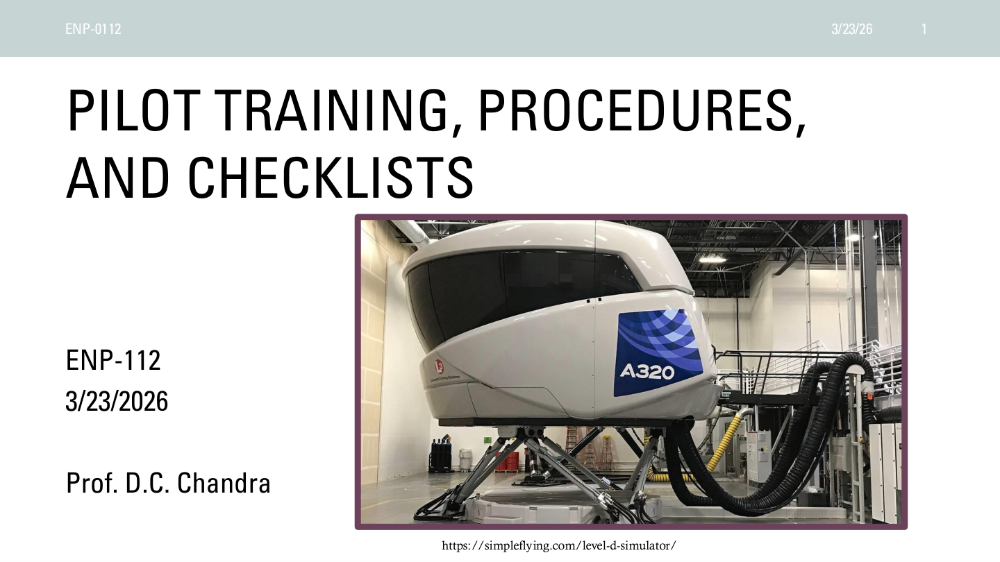
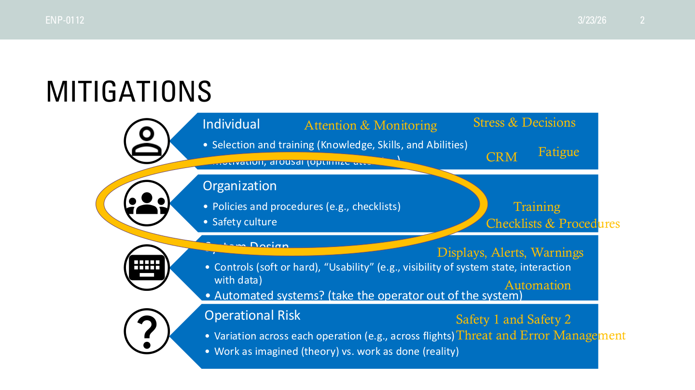
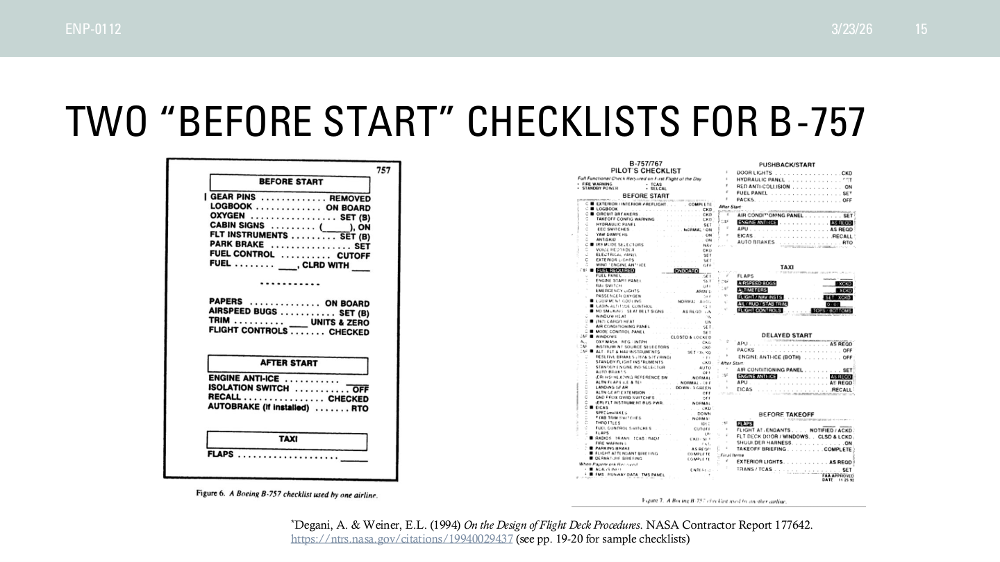

# Checklists and Procedures

This page explains the design logic of checklists and procedures and how standardization reduces memory burden while supporting team coordination.

## At a Glance

Checklists and procedures do not exist to make people mechanical. They externalize vulnerable steps so the work becomes shared, checkable, and repeatable.

## Core Logic

- a checklist is a cognitive scaffold, not just a memory aid
- a procedure is an organizational commitment about how normal work should be performed
- shared procedural language reduces coordination cost and improves handoff and review

## What Good Design Does

Good procedures put critical steps in usable order, make checkpoints visible and confirmable, and provide escalation paths for abnormal situations.

## Common Difficulty

Standardization helps, but only if it fits real work. When procedures diverge from work as done, operators begin to route around them.

## Visuals and Page Previews

This gallery shows automatically extracted figures or page previews from the original PPT/PDF sources.

<div class="note-visual-grid">
  <figure class="note-visual">
    
    <figcaption>Checklists and Procedures 3-23-26.pdf · page 1 preview</figcaption>
  </figure>
  <figure class="note-visual">
    
    <figcaption>Checklists and Procedures 3-23-26.pdf · page 2 preview</figcaption>
  </figure>
  <figure class="note-visual">
    
    <figcaption>Checklists and Procedures 3-23-26.pdf · page 15 preview</figcaption>
  </figure>
</div>

## Source Scope and Related Topics

The teaching notes come first. This section lists the source files used on the page, and the appendix keeps the full line-by-line transcription for verification.

- Section: `Aviation and Automation`
- Source files: 1
- Text units: 330
- Visuals/previews: 3

| Source | Type | Text Units | Visuals | Download |
| --- | --- | ---: | ---: | --- |
| `Checklists and Procedures 3-23-26.pdf` | `pdf` | 330 | 3 | [open](../assets/source_files/Lectures_Spring_2026/Checklists and Procedures 3-23-26.pdf) |

## Related Topics

- [Crew Resource Management](crew_resource_management.en.md)
- [Displays and Alerts](displays_and_alerts.en.md)
- [Operational Risk](../HFE_Cases_Ethics/operational_risk.en.md)

## Original Transcription and Coverage Mapping

The collapsible blocks below preserve page/slide-level source transcription. Each `unit_id` maps one-to-one in `data/coverage_map.json`.

??? info "Checklists and Procedures 3-23-26.pdf | 330 text units"
    Download source: [Checklists and Procedures 3-23-26.pdf](../assets/source_files/Lectures_Spring_2026/Checklists and Procedures 3-23-26.pdf)
    Mapped page: `checklists_and_procedures`
    
    ```text
    [checklists-and-procedures-3-23-26-0001] page:1:line:1 | PILOT TRAINING, PROCEDURES,
    [checklists-and-procedures-3-23-26-0002] page:1:line:2 | AND CHECKLISTS
    [checklists-and-procedures-3-23-26-0003] page:1:line:3 | ENP-112
    [checklists-and-procedures-3-23-26-0004] page:1:line:4 | 3/23/2026
    [checklists-and-procedures-3-23-26-0005] page:1:line:5 | Prof. D.C. Chandra
    [checklists-and-procedures-3-23-26-0006] page:1:line:6 | 3/23/26
    [checklists-and-procedures-3-23-26-0007] page:1:line:7 | ENP-0112
    [checklists-and-procedures-3-23-26-0008] page:1:line:8 | 1
    [checklists-and-procedures-3-23-26-0009] page:1:line:9 | https://simpleflying.com/level-d-simulator/
    [checklists-and-procedures-3-23-26-0010] page:2:line:1 | MITIGATIONS
    [checklists-and-procedures-3-23-26-0011] page:2:line:2 | 3/23/26
    [checklists-and-procedures-3-23-26-0012] page:2:line:3 | ENP-0112
    [checklists-and-procedures-3-23-26-0013] page:2:line:4 | 2
    [checklists-and-procedures-3-23-26-0014] page:2:line:5 | Individual
    [checklists-and-procedures-3-23-26-0015] page:2:line:6 | • Selection and training (Knowledge, Skills, and Abilities)
    [checklists-and-procedures-3-23-26-0016] page:2:line:7 | • Motivation, arousal (optimize attention)
    [checklists-and-procedures-3-23-26-0017] page:2:line:8 | Organization
    [checklists-and-procedures-3-23-26-0018] page:2:line:9 | • Policies and procedures (e.g., checklists)
    [checklists-and-procedures-3-23-26-0019] page:2:line:10 | • Safety culture
    [checklists-and-procedures-3-23-26-0020] page:2:line:11 | System Design
    [checklists-and-procedures-3-23-26-0021] page:2:line:12 | • Controls (soft or hard), “Usability” (e.g., visibility of system state, interaction
    [checklists-and-procedures-3-23-26-0022] page:2:line:13 | with data)
    [checklists-and-procedures-3-23-26-0023] page:2:line:14 | • Automated systems? (take the operator out of the system)
    [checklists-and-procedures-3-23-26-0024] page:2:line:15 | Operational Risk
    [checklists-and-procedures-3-23-26-0025] page:2:line:16 | • Variation across each operation (e.g., across flights)
    [checklists-and-procedures-3-23-26-0026] page:2:line:17 | • Work as imagined (theory) vs. work as done (reality)
    [checklists-and-procedures-3-23-26-0027] page:2:line:18 | Safety 1 and Safety 2
    [checklists-and-procedures-3-23-26-0028] page:2:line:19 | Threat and Error Management
    [checklists-and-procedures-3-23-26-0029] page:2:line:20 | Training
    [checklists-and-procedures-3-23-26-0030] page:2:line:21 | Checklists & Procedures
    [checklists-and-procedures-3-23-26-0031] page:2:line:22 | CRM
    [checklists-and-procedures-3-23-26-0032] page:2:line:23 | Fatigue
    [checklists-and-procedures-3-23-26-0033] page:2:line:24 | Stress & Decisions
    [checklists-and-procedures-3-23-26-0034] page:2:line:25 | Attention & Monitoring
    [checklists-and-procedures-3-23-26-0035] page:2:line:26 | Displays, Alerts, Warnings
    [checklists-and-procedures-3-23-26-0036] page:2:line:27 | Automation
    [checklists-and-procedures-3-23-26-0037] page:3:line:1 | TOPICS
    [checklists-and-procedures-3-23-26-0038] page:3:line:2 | • Pilot training
    [checklists-and-procedures-3-23-26-0039] page:3:line:3 | • Procedures
    [checklists-and-procedures-3-23-26-0040] page:3:line:4 | • Checklists
    [checklists-and-procedures-3-23-26-0041] page:3:line:5 | • Continuing the Flying vs. Driving discussion
    [checklists-and-procedures-3-23-26-0042] page:3:line:6 | 3/23/26
    [checklists-and-procedures-3-23-26-0043] page:3:line:7 | ENP-0112
    [checklists-and-procedures-3-23-26-0044] page:3:line:8 | 3
    [checklists-and-procedures-3-23-26-0045] page:4:line:1 | PILOT TRAINING – CONCEPTS AND VOCABULARY
    [checklists-and-procedures-3-23-26-0046] page:4:line:2 | • Training programs are covered under different FAA regulations
    [checklists-and-procedures-3-23-26-0047] page:4:line:3 | • Title 14 Code of Federal Regulations (CFR)
    [checklists-and-procedures-3-23-26-0048] page:4:line:4 | • Part 61 regulates the certification of pilots
    [checklists-and-procedures-3-23-26-0049] page:4:line:5 | • Part 141 regulates pilot schools, more formal program with FAA-approved standard curriculum
    [checklists-and-procedures-3-23-26-0050] page:4:line:6 | • Part 142 is a “flight center” with simulator training for professional pilots (no airplanes),
    [checklists-and-procedures-3-23-26-0051] page:4:line:7 | emphasizes instrument flying skills, checklists, various types of failures, etc.
    [checklists-and-procedures-3-23-26-0052] page:4:line:8 | • Advanced Qualification Program (AQP) a voluntary alternative method used by most major
    [checklists-and-procedures-3-23-26-0053] page:4:line:9 | airlines in the United States
    [checklists-and-procedures-3-23-26-0054] page:4:line:10 | • Ab Initio training programs are run by some airlines (e.g., Lufthansa)
    [checklists-and-procedures-3-23-26-0055] page:4:line:11 | 3/23/26
    [checklists-and-procedures-3-23-26-0056] page:4:line:12 | ENP-0112
    [checklists-and-procedures-3-23-26-0057] page:4:line:13 | 4
    [checklists-and-procedures-3-23-26-0058] page:5:line:1 | AQP TRAINING
    [checklists-and-procedures-3-23-26-0059] page:5:line:2 | • Formal mapping of training goals and evaluation criteria to simulator sessions.
    [checklists-and-procedures-3-23-26-0060] page:5:line:3 | • Responsive to changes, continuous improvement, evidence-based training scenarios.
    [checklists-and-procedures-3-23-26-0061] page:5:line:4 | • Based upon use of Line Operational Simulation (LOS)
    [checklists-and-procedures-3-23-26-0062] page:5:line:5 | • LOS used for training are called Line Oriented Flight Training (LOFT)
    [checklists-and-procedures-3-23-26-0063] page:5:line:6 | • LOS used for evaluation are called Line Operational Evaluation (LOE)
    [checklists-and-procedures-3-23-26-0064] page:5:line:7 | • Evaluating CRM
    [checklists-and-procedures-3-23-26-0065] page:5:line:8 | • For example, the ATSB report on QF 32 refers to Salas et al. (1999) and lists a table of observable CRM
    [checklists-and-procedures-3-23-26-0066] page:5:line:9 | skills (see lecture slides from 1/28/26)
    [checklists-and-procedures-3-23-26-0067] page:5:line:10 | • See also Pettitt, M. & Dunlap, J. Skills Development and Assessment in the AQP Environment. Skills
    [checklists-and-procedures-3-23-26-0068] page:5:line:11 | Development in AQP (faa.gov)
    [checklists-and-procedures-3-23-26-0069] page:5:line:12 | Salas, E., Prince, C., Bowers, C., Stout, R., Oser, R.L., & Cannon-Bowers, J.A. (1999). A methodology for
    [checklists-and-procedures-3-23-26-0070] page:5:line:13 | enhancing crew resource management training. Human Factors, 41, p.163.
    [checklists-and-procedures-3-23-26-0071] page:5:line:14 | 3/23/26
    [checklists-and-procedures-3-23-26-0072] page:5:line:15 | ENP-0112
    [checklists-and-procedures-3-23-26-0073] page:5:line:16 | 5
    [checklists-and-procedures-3-23-26-0074] page:6:line:1 | ON THE JOB PILOT TRAINING
    [checklists-and-procedures-3-23-26-0075] page:6:line:2 | • Promotion sequence within an airline  – going from FO to CA position
    [checklists-and-procedures-3-23-26-0076] page:6:line:3 | • Initial operating experience (IOE) – first time with passengers and a check airman
    [checklists-and-procedures-3-23-26-0077] page:6:line:4 | • Types of pilots within an airline
    [checklists-and-procedures-3-23-26-0078] page:6:line:5 | • Line pilot
    [checklists-and-procedures-3-23-26-0079] page:6:line:6 | • Check airman
    [checklists-and-procedures-3-23-26-0080] page:6:line:7 | • Simulator Instructor
    [checklists-and-procedures-3-23-26-0081] page:6:line:8 | • Technical pilot
    [checklists-and-procedures-3-23-26-0082] page:6:line:9 | • Management pilot
    [checklists-and-procedures-3-23-26-0083] page:6:line:10 | 3/23/26
    [checklists-and-procedures-3-23-26-0084] page:6:line:11 | ENP-0112
    [checklists-and-procedures-3-23-26-0085] page:6:line:12 | 6
    [checklists-and-procedures-3-23-26-0086] page:7:line:1 | ESTABLISHING AND MAINTAINING CULTURE NORMS
    [checklists-and-procedures-3-23-26-0087] page:7:line:2 | • Philosophy, Policies, Procedures ➔ Practice
    [checklists-and-procedures-3-23-26-0088] page:7:line:3 | • (Company) Philosophy
    [checklists-and-procedures-3-23-26-0089] page:7:line:4 | • Overarching view of how to conduct business (flight operations)
    [checklists-and-procedures-3-23-26-0090] page:7:line:5 | • Related to company culture
    [checklists-and-procedures-3-23-26-0091] page:7:line:6 | • Example: How much discretion the individual pilot has.
    [checklists-and-procedures-3-23-26-0092] page:7:line:7 | • Can the FO call for a rejected takeoff when they are the PF or does the CA have to call for it
    [checklists-and-procedures-3-23-26-0093] page:7:line:8 | regardless?
    [checklists-and-procedures-3-23-26-0094] page:7:line:9 | • Example: When to use Automation?
    [checklists-and-procedures-3-23-26-0095] page:7:line:10 | • Use it as often as possible or is the pilot allowed the discretion to fly manually?
    [checklists-and-procedures-3-23-26-0096] page:7:line:11 | 3/23/26
    [checklists-and-procedures-3-23-26-0097] page:7:line:12 | ENP-0112
    [checklists-and-procedures-3-23-26-0098] page:7:line:13 | 7
    [checklists-and-procedures-3-23-26-0099] page:8:line:1 | PROCEDURES
    [checklists-and-procedures-3-23-26-0100] page:8:line:2 | • As opposed to individual “pilot technique”
    [checklists-and-procedures-3-23-26-0101] page:8:line:3 | • Standard Operating Procedures – improve standardization of procedures, but can vary between companies/operators
    [checklists-and-procedures-3-23-26-0102] page:8:line:4 | • Procedures unambiguously specify
    [checklists-and-procedures-3-23-26-0103] page:8:line:5 | •
    [checklists-and-procedures-3-23-26-0104] page:8:line:6 | What the task is
    [checklists-and-procedures-3-23-26-0105] page:8:line:7 | •
    [checklists-and-procedures-3-23-26-0106] page:8:line:8 | When the task is done (time and sequence)
    [checklists-and-procedures-3-23-26-0107] page:8:line:9 | •
    [checklists-and-procedures-3-23-26-0108] page:8:line:10 | By whom
    [checklists-and-procedures-3-23-26-0109] page:8:line:11 | •
    [checklists-and-procedures-3-23-26-0110] page:8:line:12 | How (actions)
    [checklists-and-procedures-3-23-26-0111] page:8:line:13 | •
    [checklists-and-procedures-3-23-26-0112] page:8:line:14 | The sequence of actions
    [checklists-and-procedures-3-23-26-0113] page:8:line:15 | •
    [checklists-and-procedures-3-23-26-0114] page:8:line:16 | The feedback (callout, indicator)
    [checklists-and-procedures-3-23-26-0115] page:8:line:17 | • The result is a task that is carried out efficiently, logically, in an error-resistant manner. The procedure should also
    [checklists-and-procedures-3-23-26-0116] page:8:line:18 | promote coordination.
    [checklists-and-procedures-3-23-26-0117] page:8:line:19 | • Examples: approach procedure, landing procedure, departure procedure
    [checklists-and-procedures-3-23-26-0118] page:8:line:20 | 3/23/26
    [checklists-and-procedures-3-23-26-0119] page:8:line:21 | ENP-0112
    [checklists-and-procedures-3-23-26-0120] page:8:line:22 | 8
    [checklists-and-procedures-3-23-26-0121] page:8:line:23 | Degani, A. & Weiner, E.L. (1994) On the Design of  Flight Deck Procedures. NASA Contractor Report 177642.
    [checklists-and-procedures-3-23-26-0122] page:8:line:24 | https://ntrs.nasa.gov/citations/19940029437
    [checklists-and-procedures-3-23-26-0123] page:9:line:1 | PROCEDURE EXAMPLE: BRIEFINGS AND DEBRIEFINGS
    [checklists-and-procedures-3-23-26-0124] page:9:line:2 | • Briefings are used in many settings, not just aviation (e.g., military medical, shift work). They quickly
    [checklists-and-procedures-3-23-26-0125] page:9:line:3 | and accurately convey key aspects of a situation.
    [checklists-and-procedures-3-23-26-0126] page:9:line:4 | • Example for setting up a route in the Flight Management System (FMS)
    [checklists-and-procedures-3-23-26-0127] page:9:line:5 | • “Three-step glass cockpit briefing” (Lutat & Swah, 2013)
    [checklists-and-procedures-3-23-26-0128] page:9:line:6 | •
    [checklists-and-procedures-3-23-26-0129] page:9:line:7 | “Build,” load, or select the appropriate (instrument flight) procedure [route to follow] from the FMS database with direct
    [checklists-and-procedures-3-23-26-0130] page:9:line:8 | reference to the current chart.
    [checklists-and-procedures-3-23-26-0131] page:9:line:9 | •
    [checklists-and-procedures-3-23-26-0132] page:9:line:10 | Rigorously check the FMS programming for compatibility with the aircraft clearance.
    [checklists-and-procedures-3-23-26-0133] page:9:line:11 | •
    [checklists-and-procedures-3-23-26-0134] page:9:line:12 | The pilot flying (workload permitting) briefs the procedure from the FMS, while pilot monitoring (ideally) checks the
    [checklists-and-procedures-3-23-26-0135] page:9:line:13 | programming against the appropriate chart(s).
    [checklists-and-procedures-3-23-26-0136] page:9:line:14 | • What is a “debriefing”? (Forrest, 2015)
    [checklists-and-procedures-3-23-26-0137] page:9:line:15 | • Discussion after completing a task. How did it go?
    [checklists-and-procedures-3-23-26-0138] page:9:line:16 | • Briefings in theory vs. briefings in practice (Chandra and Markunas, 2017)
    [checklists-and-procedures-3-23-26-0139] page:9:line:17 | 3/23/26
    [checklists-and-procedures-3-23-26-0140] page:9:line:18 | ENP-0112
    [checklists-and-procedures-3-23-26-0141] page:9:line:19 | 9
    [checklists-and-procedures-3-23-26-0142] page:10:line:1 | CHECKLISTS
    [checklists-and-procedures-3-23-26-0143] page:10:line:2 | 3/23/26
    [checklists-and-procedures-3-23-26-0144] page:10:line:3 | ENP-0112
    [checklists-and-procedures-3-23-26-0145] page:10:line:4 | 10
    [checklists-and-procedures-3-23-26-0146] page:11:line:1 | CHECKLISTS – CONCEPTS AND VOCABULARY
    [checklists-and-procedures-3-23-26-0147] page:11:line:2 | • Normal checklists are for checking, not to-do lists
    [checklists-and-procedures-3-23-26-0148] page:11:line:3 | • Abnormal/emergency checklists are READ-DO lists
    [checklists-and-procedures-3-23-26-0149] page:11:line:4 | • Electronic checklists
    [checklists-and-procedures-3-23-26-0150] page:11:line:5 | • https://skybrary.aero/articles/checklists-purpose-and-use
    [checklists-and-procedures-3-23-26-0151] page:11:line:6 | • Checklists are used in many domains. Broad applications.
    [checklists-and-procedures-3-23-26-0152] page:11:line:7 | 3/23/26
    [checklists-and-procedures-3-23-26-0153] page:11:line:8 | ENP-0112
    [checklists-and-procedures-3-23-26-0154] page:11:line:9 | 11
    [checklists-and-procedures-3-23-26-0155] page:11:line:10 | Higgins, W.Y., & Boorman, D.J. (2016) An Analysis of the Effectiveness of Checklists when combined
    [checklists-and-procedures-3-23-26-0156] page:11:line:11 | with Other Processes, Methods and Tools to Reduce Risk in High Hazard Activities. Boeing Technical
    [checklists-and-procedures-3-23-26-0157] page:11:line:12 | Journal. (Available in Canvas, Supplementary Readings)
    [checklists-and-procedures-3-23-26-0158] page:12:line:1 | NORMAL CREW CHECKLISTS
    [checklists-and-procedures-3-23-26-0159] page:12:line:2 | • Intended to verify/check actions that were accomplished from memory
    [checklists-and-procedures-3-23-26-0160] page:12:line:3 | • Flow patterns
    [checklists-and-procedures-3-23-26-0161] page:12:line:4 | • Mnemonics
    [checklists-and-procedures-3-23-26-0162] page:12:line:5 | •
    [checklists-and-procedures-3-23-26-0163] page:12:line:6 | e.g., GUMPS for pre-landing checklist – gas, undercarriage, (full rich fuel) mixture, propeller, seat belts & switches set
    [checklists-and-procedures-3-23-26-0164] page:12:line:7 | • On aircraft that require a crew of two, often the non-flying pilot will read the checklist and each item
    [checklists-and-procedures-3-23-26-0165] page:12:line:8 | will be accomplished and acknowledged.
    [checklists-and-procedures-3-23-26-0166] page:12:line:9 | • Examples
    [checklists-and-procedures-3-23-26-0167] page:12:line:10 | • Before start
    [checklists-and-procedures-3-23-26-0168] page:12:line:11 | • Before Taxi/After Engine Start
    [checklists-and-procedures-3-23-26-0169] page:12:line:12 | • Before takeoff, After takeoff
    [checklists-and-procedures-3-23-26-0170] page:12:line:13 | • Pre-approach
    [checklists-and-procedures-3-23-26-0171] page:12:line:14 | • Before landing
    [checklists-and-procedures-3-23-26-0172] page:12:line:15 | 3/23/26
    [checklists-and-procedures-3-23-26-0173] page:12:line:16 | ENP-0112
    [checklists-and-procedures-3-23-26-0174] page:12:line:17 | 12
    [checklists-and-procedures-3-23-26-0175] page:13:line:1 | NON-NORMAL CREW CHECKLISTS
    [checklists-and-procedures-3-23-26-0176] page:13:line:2 | • Abnormal/Non-normal
    [checklists-and-procedures-3-23-26-0177] page:13:line:3 | • Emergency
    [checklists-and-procedures-3-23-26-0178] page:13:line:4 | • Quick Reference Handbook (physical book)
    [checklists-and-procedures-3-23-26-0179] page:13:line:5 | • https://skybrary.aero/articles/quick-reference-handbook-qrh
    [checklists-and-procedures-3-23-26-0180] page:13:line:6 | • Can be part of an Electronic Checklist (ECL) shown on a flight deck or hand-held
    [checklists-and-procedures-3-23-26-0181] page:13:line:7 | display
    [checklists-and-procedures-3-23-26-0182] page:13:line:8 | 3/23/26
    [checklists-and-procedures-3-23-26-0183] page:13:line:9 | ENP-0112
    [checklists-and-procedures-3-23-26-0184] page:13:line:10 | 13
    [checklists-and-procedures-3-23-26-0185] page:14:line:1 | CHECKLISTS DESIGN ISSUES
    [checklists-and-procedures-3-23-26-0186] page:14:line:2 | • Typical user-interface issues
    [checklists-and-procedures-3-23-26-0187] page:14:line:3 | • Content (correct steps, correct order etc.)
    [checklists-and-procedures-3-23-26-0188] page:14:line:4 | • Clear communication (wording)
    [checklists-and-procedures-3-23-26-0189] page:14:line:5 | • Format (easy to read, clear mapping of steps)
    [checklists-and-procedures-3-23-26-0190] page:14:line:6 | • Help the pilot to ensure every necessary item is completed
    [checklists-and-procedures-3-23-26-0191] page:14:line:7 | 3/23/26
    [checklists-and-procedures-3-23-26-0192] page:14:line:8 | ENP-0112
    [checklists-and-procedures-3-23-26-0193] page:14:line:9 | 14
    [checklists-and-procedures-3-23-26-0194] page:15:line:1 | TWO “BEFORE START” CHECKLISTS FOR B-757
    [checklists-and-procedures-3-23-26-0195] page:15:line:2 | 3/23/26
    [checklists-and-procedures-3-23-26-0196] page:15:line:3 | ENP-0112
    [checklists-and-procedures-3-23-26-0197] page:15:line:4 | 15
    [checklists-and-procedures-3-23-26-0198] page:15:line:5 | *Degani, A. & Weiner, E.L. (1994) On the Design of Flight Deck Procedures. NASA Contractor Report 177642.
    [checklists-and-procedures-3-23-26-0199] page:15:line:6 | https://ntrs.nasa.gov/citations/19940029437 (see pp. 19-20 for sample checklists)
    [checklists-and-procedures-3-23-26-0200] page:16:line:1 | CHECKLIST EVOLUTION: STANDARDIZATION VS.
    [checklists-and-procedures-3-23-26-0201] page:16:line:2 | FLEXIBILITY
    [checklists-and-procedures-3-23-26-0202] page:16:line:3 | • Sample checklists for B-757 from two different airlines in Degani and Weiner (1994)
    [checklists-and-procedures-3-23-26-0203] page:16:line:4 | • Standardization is good…
    [checklists-and-procedures-3-23-26-0204] page:16:line:5 | • Over time, transitioned to using versions from the original equipment manufacturer
    [checklists-and-procedures-3-23-26-0205] page:16:line:6 | • Eventually, these versions in the Aircraft Flight Manual (AFM) were coded into
    [checklists-and-procedures-3-23-26-0206] page:16:line:7 | electronic checklists
    [checklists-and-procedures-3-23-26-0207] page:16:line:8 | • However, it is difficult to modify after the checklists are part of the airplane
    [checklists-and-procedures-3-23-26-0208] page:16:line:9 | software (due to Certification costs)
    [checklists-and-procedures-3-23-26-0209] page:16:line:10 | 3/23/26
    [checklists-and-procedures-3-23-26-0210] page:16:line:11 | ENP-0112
    [checklists-and-procedures-3-23-26-0211] page:16:line:12 | 16
    [checklists-and-procedures-3-23-26-0212] page:17:line:1 | REFERENCES
    [checklists-and-procedures-3-23-26-0213] page:17:line:2 | https://www.faa.gov/pilots/training
    [checklists-and-procedures-3-23-26-0214] page:17:line:3 | https://www.faa.gov/regulations_policies/handbooks_manuals/aviation
    [checklists-and-procedures-3-23-26-0215] page:17:line:4 | Instrument flying handbook
    [checklists-and-procedures-3-23-26-0216] page:17:line:5 | AQP Program
    [checklists-and-procedures-3-23-26-0217] page:17:line:6 | AQP documents
    [checklists-and-procedures-3-23-26-0218] page:17:line:7 | https://simpleflying.com/level-d-simulator/
    [checklists-and-procedures-3-23-26-0219] page:17:line:8 | Degani, A. & Weiner, E.L. (1994) On the Design of Flight Deck Procedures. NASA Contractor Report 177642. https://ntrs.nasa.gov/citations/19940029437 (see pp.
    [checklists-and-procedures-3-23-26-0220] page:17:line:9 | 19-20 for sample checklists)
    [checklists-and-procedures-3-23-26-0221] page:17:line:10 | Burian, Barshi, & Dismukes (2005). The challenge of aviation emergency and abnormal situations. NASA/TM-2005-213462
    [checklists-and-procedures-3-23-26-0222] page:17:line:11 | Lutat, C. J., & Swah, S. R. (2013). Automation Airmanship: Nine Principles for Operating Glass Cockpit Aircraft. New York: McGraw-Hill Education.
    [checklists-and-procedures-3-23-26-0223] page:17:line:12 | Forrest, S. (2015, December). Cockpit briefings and debriefings by the PIC are vital safety tools. Professional Pilot Magazine, 49(12), 54-56.
    [checklists-and-procedures-3-23-26-0224] page:17:line:13 | Chandra, D.C., and Markunas, R. (2017). Line Pilot Perspectives on Complexity of Terminal Instrument Flight Procedures, DOT-VNTSC-FAA-17-06. U.S. DOT
    [checklists-and-procedures-3-23-26-0225] page:17:line:14 | Volpe National Transportation Systems Center, Cambridge, MA.
    [checklists-and-procedures-3-23-26-0226] page:17:line:15 | Higgins, W.Y., & Boorman, D.J. (2016) An Analysis of the Effectiveness of Checklists when combined with Other Processes, Methods and Tools to Reduce Risk
    [checklists-and-procedures-3-23-26-0227] page:17:line:16 | in High Hazard Activities. Boeing Technical Journal.
    [checklists-and-procedures-3-23-26-0228] page:17:line:17 | 3/23/26
    [checklists-and-procedures-3-23-26-0229] page:17:line:18 | ENP-0112
    [checklists-and-procedures-3-23-26-0230] page:17:line:19 | 17
    [checklists-and-procedures-3-23-26-0231] page:18:line:1 | DRIVING VS. FLYING
    [checklists-and-procedures-3-23-26-0232] page:18:line:2 | 3/23/26
    [checklists-and-procedures-3-23-26-0233] page:18:line:3 | ENP-0112
    [checklists-and-procedures-3-23-26-0234] page:18:line:4 | 18
    [checklists-and-procedures-3-23-26-0235] page:19:line:1 | DIMENSIONS FOR COMPARING FLYING VS. DRIVING
    [checklists-and-procedures-3-23-26-0236] page:19:line:2 | Driving
    [checklists-and-procedures-3-23-26-0237] page:19:line:3 | • Private risk (non-commercial ops)
    [checklists-and-procedures-3-23-26-0238] page:19:line:4 | • 1 driver
    [checklists-and-procedures-3-23-26-0239] page:19:line:5 | • Regulation by State DOT
    [checklists-and-procedures-3-23-26-0240] page:19:line:6 | • Glances away (few seconds at most)
    [checklists-and-procedures-3-23-26-0241] page:19:line:7 | • Insurance industry
    [checklists-and-procedures-3-23-26-0242] page:19:line:8 | What else?
    [checklists-and-procedures-3-23-26-0243] page:19:line:9 | Airline (Commercial) Flying
    [checklists-and-procedures-3-23-26-0244] page:19:line:10 | • Public risk
    [checklists-and-procedures-3-23-26-0245] page:19:line:11 | •  2 pilots (airline ops)
    [checklists-and-procedures-3-23-26-0246] page:19:line:12 | • Federal regulator
    [checklists-and-procedures-3-23-26-0247] page:19:line:13 | • Can look away for much longer
    [checklists-and-procedures-3-23-26-0248] page:19:line:14 | (cruise), (practiced) instrument scan
    [checklists-and-procedures-3-23-26-0249] page:19:line:15 | What else?
    [checklists-and-procedures-3-23-26-0250] page:19:line:16 | 3/23/26
    [checklists-and-procedures-3-23-26-0251] page:19:line:17 | ENP-0112
    [checklists-and-procedures-3-23-26-0252] page:19:line:18 | 19
    [checklists-and-procedures-3-23-26-0253] page:20:line:1 | MANAGING RISK: OPERATIONAL COMPLEXITY IN
    [checklists-and-procedures-3-23-26-0254] page:20:line:2 | FLIGHT OPERATIONS – DRIVING: THE “ODD”
    [checklists-and-procedures-3-23-26-0255] page:20:line:3 | Operational Complexity
    [checklists-and-procedures-3-23-26-0256] page:20:line:4 | • ATC interventions
    [checklists-and-procedures-3-23-26-0257] page:20:line:5 | • Aircraft Vehicle equipment or
    [checklists-and-procedures-3-23-26-0258] page:20:line:6 | performance
    [checklists-and-procedures-3-23-26-0259] page:20:line:7 | • Crew Driver factors
    [checklists-and-procedures-3-23-26-0260] page:20:line:8 | • Operator factors
    [checklists-and-procedures-3-23-26-0261] page:20:line:9 | • Environment factors
    [checklists-and-procedures-3-23-26-0262] page:20:line:10 | Aircraft Vehicle Factors
    [checklists-and-procedures-3-23-26-0263] page:20:line:11 | •
    [checklists-and-procedures-3-23-26-0264] page:20:line:12 | Lack or unreliability of
    [checklists-and-procedures-3-23-26-0265] page:20:line:13 | automated systems
    [checklists-and-procedures-3-23-26-0266] page:20:line:14 | •
    [checklists-and-procedures-3-23-26-0267] page:20:line:15 | Performance characteristics
    [checklists-and-procedures-3-23-26-0268] page:20:line:16 | ATC Intervention (such as)
    [checklists-and-procedures-3-23-26-0269] page:20:line:17 | •
    [checklists-and-procedures-3-23-26-0270] page:20:line:18 | (Late) route amendments
    [checklists-and-procedures-3-23-26-0271] page:20:line:19 | •
    [checklists-and-procedures-3-23-26-0272] page:20:line:20 | Unpublished restrictions
    [checklists-and-procedures-3-23-26-0273] page:20:line:21 | •
    [checklists-and-procedures-3-23-26-0274] page:20:line:22 | Vectors
    [checklists-and-procedures-3-23-26-0275] page:20:line:23 | Environment Factors
    [checklists-and-procedures-3-23-26-0276] page:20:line:24 | •
    [checklists-and-procedures-3-23-26-0277] page:20:line:25 | Terrain
    [checklists-and-procedures-3-23-26-0278] page:20:line:26 | •
    [checklists-and-procedures-3-23-26-0279] page:20:line:27 | Traffic
    [checklists-and-procedures-3-23-26-0280] page:20:line:28 | •
    [checklists-and-procedures-3-23-26-0281] page:20:line:29 | Weather
    [checklists-and-procedures-3-23-26-0282] page:20:line:30 | •
    [checklists-and-procedures-3-23-26-0283] page:20:line:31 | Prohibited  airspace roads
    [checklists-and-procedures-3-23-26-0284] page:20:line:32 | Operator Factors
    [checklists-and-procedures-3-23-26-0285] page:20:line:33 | •
    [checklists-and-procedures-3-23-26-0286] page:20:line:34 | Independence vs. dependence
    [checklists-and-procedures-3-23-26-0287] page:20:line:35 | on Dispatch
    [checklists-and-procedures-3-23-26-0288] page:20:line:36 | •
    [checklists-and-procedures-3-23-26-0289] page:20:line:37 | Clarity and consistency of
    [checklists-and-procedures-3-23-26-0290] page:20:line:38 | pilot roles in reviewing route
    [checklists-and-procedures-3-23-26-0291] page:20:line:39 | Crew Driver Factors
    [checklists-and-procedures-3-23-26-0292] page:20:line:40 | •
    [checklists-and-procedures-3-23-26-0293] page:20:line:41 | Expectations (confirmation bias)
    [checklists-and-procedures-3-23-26-0294] page:20:line:42 | •
    [checklists-and-procedures-3-23-26-0295] page:20:line:43 | Fatigue
    [checklists-and-procedures-3-23-26-0296] page:20:line:44 | •
    [checklists-and-procedures-3-23-26-0297] page:20:line:45 | Communication style
    [checklists-and-procedures-3-23-26-0298] page:20:line:46 | •
    [checklists-and-procedures-3-23-26-0299] page:20:line:47 | Distractions
    [checklists-and-procedures-3-23-26-0300] page:20:line:48 | •
    [checklists-and-procedures-3-23-26-0301] page:20:line:49 | Local area familiarity
    [checklists-and-procedures-3-23-26-0302] page:20:line:50 | •
    [checklists-and-procedures-3-23-26-0303] page:20:line:51 | Familiarity with different types of
    [checklists-and-procedures-3-23-26-0304] page:20:line:52 | routes
    [checklists-and-procedures-3-23-26-0305] page:20:line:53 | (2/18/26 lecture)
    [checklists-and-procedures-3-23-26-0306] page:20:line:54 | 3/23/26
    [checklists-and-procedures-3-23-26-0307] page:20:line:55 | ENP-0112
    [checklists-and-procedures-3-23-26-0308] page:20:line:56 | 20
    [checklists-and-procedures-3-23-26-0309] page:21:line:1 | MORE DRIVING VS. FLYING
    [checklists-and-procedures-3-23-26-0310] page:21:line:2 | Driving
    [checklists-and-procedures-3-23-26-0311] page:21:line:3 | • Relatively little training and currency checks
    [checklists-and-procedures-3-23-26-0312] page:21:line:4 | • Wider population of operators
    [checklists-and-procedures-3-23-26-0313] page:21:line:5 | • Could stop and reset/review
    [checklists-and-procedures-3-23-26-0314] page:21:line:6 | • 2-D task
    [checklists-and-procedures-3-23-26-0315] page:21:line:7 | Flying
    [checklists-and-procedures-3-23-26-0316] page:21:line:8 | • Intensive training and currency reviews
    [checklists-and-procedures-3-23-26-0317] page:21:line:9 | • Relatively limited set of operators
    [checklists-and-procedures-3-23-26-0318] page:21:line:10 | • Certifications and approval of both pilots and
    [checklists-and-procedures-3-23-26-0319] page:21:line:11 | aircraft
    [checklists-and-procedures-3-23-26-0320] page:21:line:12 | • ATC monitors flights and can aid in
    [checklists-and-procedures-3-23-26-0321] page:21:line:13 | emergencies
    [checklists-and-procedures-3-23-26-0322] page:21:line:14 | • Always in motion
    [checklists-and-procedures-3-23-26-0323] page:21:line:15 | • Public expects high safety levels for
    [checklists-and-procedures-3-23-26-0324] page:21:line:16 | commercial operations
    [checklists-and-procedures-3-23-26-0325] page:21:line:17 | • 3-D task
    [checklists-and-procedures-3-23-26-0326] page:21:line:18 | 3/23/26
    [checklists-and-procedures-3-23-26-0327] page:21:line:19 | ENP-0112
    [checklists-and-procedures-3-23-26-0328] page:21:line:20 | 21
    [checklists-and-procedures-3-23-26-0329] page:21:line:21 | How does the “Operational design domain” (ODD)
    [checklists-and-procedures-3-23-26-0330] page:21:line:22 | apply to flying vs. driving?
    ```
