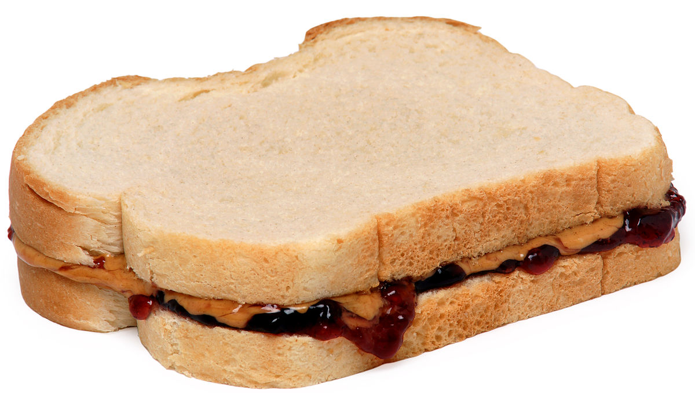
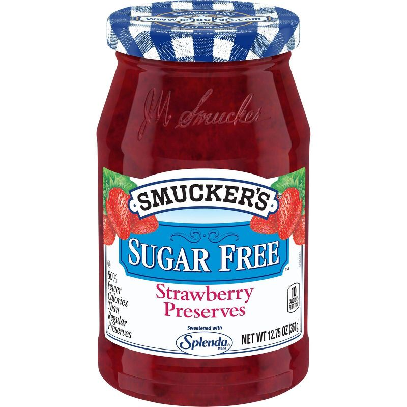
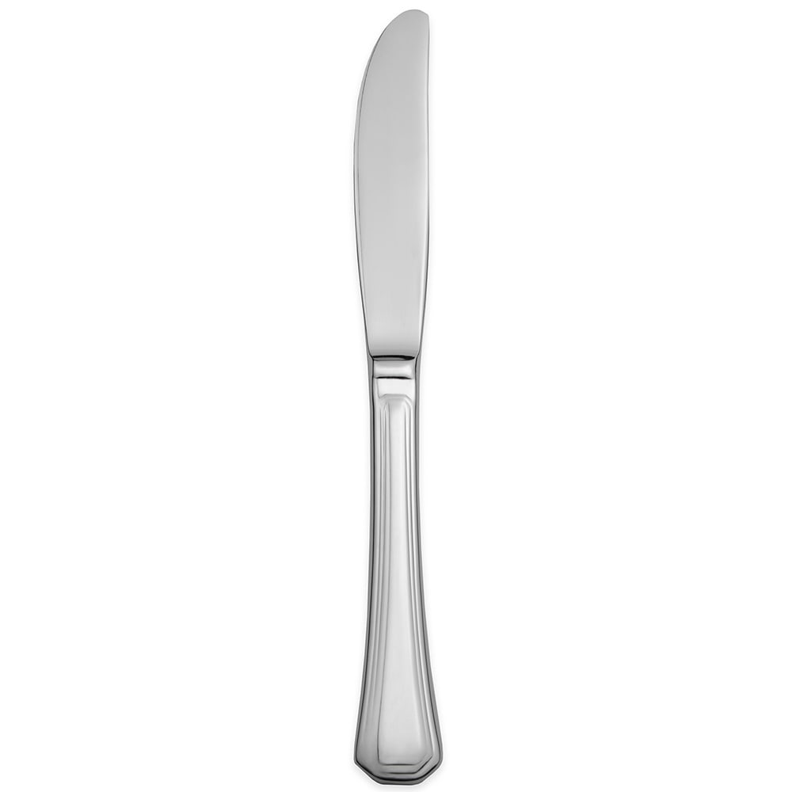
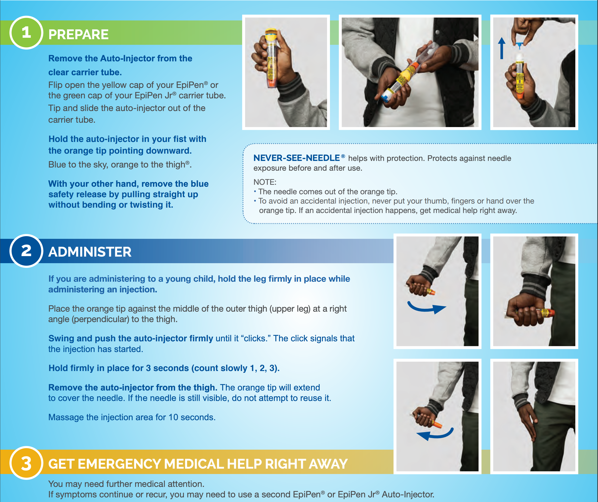

# Task Analysis

This page explains how task analysis decomposes use flow into observable tasks and subtasks that can later be evaluated for risk.

## At a Glance

Task analysis turns a continuous use episode into observable, discussable, and risk-assessable steps.

## What Gets Decomposed

- the user's goal
- the steps required to reach that goal
- the information, judgment, and action demands at each step
- the points where failure would affect safety or recovery

## Why It Matters

Task analysis is the foundation for later work. Without it, use errors, critical tasks, and controls remain vague.

## Common Difficulty

A useful task analysis is not just a rewritten instruction manual. It compares the ideal flow with the real flow that users are likely to perform in context.

## Visuals and Page Previews

This gallery shows automatically extracted figures or page previews from the original PPT/PDF sources.

<div class="note-visual-grid">
  <figure class="note-visual">
    
    <figcaption>08 Task Analysis.pptx · slide 1</figcaption>
  </figure>
  <figure class="note-visual">
    
    <figcaption>08 Task Analysis.pptx · slide 4</figcaption>
  </figure>
  <figure class="note-visual">
    
    <figcaption>08 Task Analysis.pptx · slide 5</figcaption>
  </figure>
  <figure class="note-visual">
    
    <figcaption>08 Task Analysis.pptx · slide 5</figcaption>
  </figure>
  <figure class="note-visual">
    
    <figcaption>08 Task Analysis.pptx · slide 5</figcaption>
  </figure>
  <figure class="note-visual">
    
    <figcaption>08 Task Analysis.pptx · slide 5</figcaption>
  </figure>
  <figure class="note-visual">
    
    <figcaption>08 Task Analysis.pptx · slide 5</figcaption>
  </figure>
  <figure class="note-visual">
    
    <figcaption>08 Task Analysis.pptx · slide 8</figcaption>
  </figure>
</div>

## Source Scope and Related Topics

The teaching notes come first. This section lists the source files used on the page, and the appendix keeps the full line-by-line transcription for verification.

- Section: `Risk Methods`
- Source files: 1
- Text units: 80
- Visuals/previews: 8

| Source | Type | Text Units | Visuals | Download |
| --- | --- | ---: | ---: | --- |
| `08 Task Analysis.pptx` | `pptx` | 80 | 8 | [open](../assets/source_files/ENP_111_Use_related_Risks/08 Task Analysis.pptx) |

## Related Topics

- [URRA Methods](urra_methods.en.md)
- [The EpiPen URRA Workbook](../HFE_Medical_Devices/epipen_workbook.en.md)
- [Use Errors in Medical Devices](../HFE_Medical_Devices/medical_device_use_errors.en.md)

## Original Transcription and Coverage Mapping

The collapsible blocks below preserve page/slide-level source transcription. Each `unit_id` maps one-to-one in `data/coverage_map.json`.

??? info "08 Task Analysis.pptx | 80 text units"
    Download source: [08 Task Analysis.pptx](../assets/source_files/ENP_111_Use_related_Risks/08 Task Analysis.pptx)
    Mapped page: `task_analysis`
    
    ```text
    [08-task-analysis-0001] slide:1:p:1 | Sami Durrani PhD and Eric Bergman PhD
    [08-task-analysis-0002] slide:1:p:2 | Task Analysis
    [08-task-analysis-0003] slide:2:p:1 | 2
    [08-task-analysis-0004] slide:2:p:2 | There are many different forms of task analysis
    [08-task-analysis-0005] slide:2:p:3 | Hierarchical Task Analysis (HTA)
    [08-task-analysis-0006] slide:2:p:4 | Cognitive Task Analysis (CTA)
    [08-task-analysis-0007] slide:2:p:5 | And many more variations and modifications
    [08-task-analysis-0008] slide:2:p:6 | In medical device human factors, a “task analysis” is typically a modified HTA
    [08-task-analysis-0009] slide:2:p:7 | Types of task analysis
    [08-task-analysis-0010] slide:3:p:1 | 3
    [08-task-analysis-0011] slide:3:p:2 | Identify task
    [08-task-analysis-0012] slide:3:p:3 | Decompose task into sub-tasks (if needed)
    [08-task-analysis-0013] slide:3:p:4 | List use-steps (if known and if needed)
    [08-task-analysis-0014] slide:3:p:5 | Identify potential use-errors
    [08-task-analysis-0015] slide:3:p:6 | Use PCA to help identify potential causes and potential use errors
    [08-task-analysis-0016] slide:3:p:7 | Key steps in conducting a task analysis
    [08-task-analysis-0017] slide:4:p:1 | 4
    [08-task-analysis-0018] slide:4:p:2 | Simple Example: Peanut Butter & Jelly
    [08-task-analysis-0019] slide:5:p:1 | 5
    [08-task-analysis-0020] slide:5:p:2 | Task 1: Gather supplies
    [08-task-analysis-0021] slide:5:p:3 | PB&J
    [08-task-analysis-0022] slide:5:p:4 | Task 2: Prepare bread
    [08-task-analysis-0023] slide:5:p:5 | Use steps:
    [08-task-analysis-0024] slide:5:p:6 | Remove bag slip
    [08-task-analysis-0025] slide:5:p:7 | Open bag
    [08-task-analysis-0026] slide:5:p:8 | Grasp end piece
    [08-task-analysis-0027] slide:5:p:9 | Move it out of the way
    [08-task-analysis-0028] slide:5:p:10 | Grasp next two pieces
    [08-task-analysis-0029] slide:5:p:11 | Take them out of bag
    [08-task-analysis-0030] slide:5:p:12 | Place bread slices on plate, side-by-side
    [08-task-analysis-0031] slide:5:p:13 | BUT WAIT!
    [08-task-analysis-0032] slide:5:p:14 | We forgot to wash our hands!
    [08-task-analysis-0033] slide:5:p:15 | We also forgot to make sure the ingredients aren’t expired!
    [08-task-analysis-0034] slide:6:p:1 | 6
    [08-task-analysis-0035] slide:6:p:2 | Task 3: Spread peanut butter on slice 1
    [08-task-analysis-0036] slide:6:p:3 | Task 4: Spread jam on slice 2
    [08-task-analysis-0037] slide:6:p:4 | Task 5: Combine slices together
    [08-task-analysis-0038] slide:6:p:5 | Task 6: Cut sandwich diagonally (optional)
    [08-task-analysis-0039] slide:6:p:6 | Task 7: Eat
    [08-task-analysis-0040] slide:6:p:7 | Task 8: Clean up and store supplies
    [08-task-analysis-0041] slide:6:p:8 | PBJ
    [08-task-analysis-0042] slide:7:p:1 | 7
    [08-task-analysis-0043] slide:7:p:2 | Let’s do a quick task analysis: Autoinjector
    [08-task-analysis-0044] slide:8:p:1 | Autoinjector analysis continued…
    [08-task-analysis-0045] slide:8:p:2 | 8
    [08-task-analysis-0046] slide:9:p:1 | 9
    [08-task-analysis-0047] slide:9:p:2 | Define preliminary tasks and use steps
    [08-task-analysis-0048] slide:9:p:3 | OK to make assumptions early on
    [08-task-analysis-0049] slide:9:p:4 | Develop cognitive walkthrough and design sketches/mock-ups
    [08-task-analysis-0050] slide:9:p:5 | Do a preliminary hazard analysis (PHA)
    [08-task-analysis-0051] slide:9:p:6 | But what if you don’t have a design yet?
    [08-task-analysis-0052] slide:9:p:7 | Key concept:
    [08-task-analysis-0053] slide:9:p:8 | Don’t need a device design to start identifying potential use errors
    [08-task-analysis-0054] slide:10:p:1 | 10
    [08-task-analysis-0055] slide:10:p:2 | PHA Example:  Infusion Pump
    [08-task-analysis-0056] slide:10:p:3 | Hazard
    [08-task-analysis-0057] slide:10:p:4 | Potential Causes*
    [08-task-analysis-0058] slide:10:p:5 | *note: not UEs yet
    [08-task-analysis-0059] slide:10:p:6 | Potential Consequences
    [08-task-analysis-0060] slide:10:p:7 | Drug over-infusion
    [08-task-analysis-0061] slide:10:p:8 | User data entry error
    [08-task-analysis-0062] slide:10:p:9 | User does not understand amount programmed
    [08-task-analysis-0063] slide:10:p:10 | Overdose
    [08-task-analysis-0064] slide:10:p:11 | Battery dies mid-treatment
    [08-task-analysis-0065] slide:10:p:12 | User does not recharge battery
    [08-task-analysis-0066] slide:10:p:13 | User does not know battery state
    [08-task-analysis-0067] slide:10:p:14 | Underdose
    [08-task-analysis-0068] slide:10:p:15 | Contamination at infusion site
    [08-task-analysis-0069] slide:10:p:16 | User does not use sterile components
    [08-task-analysis-0070] slide:10:p:17 | Infection
    [08-task-analysis-0071] notes:1:p:1 | Quick introductions
    [08-task-analysis-0072] notes:2:p:1 | Hierarchical Task Analysis (HTA): HTA is one of the most widely used methods. It breaks down complex tasks into a hierarchical structure, showing the relationships between higher-level goals and lower-level sub-tasks. HTA is often used to design and evaluate user interfaces and to identify potential usability issues.
    [08-task-analysis-0073] notes:2:p:2 | Cognitive Task Analysis (CTA): CTA focuses on understanding the cognitive processes, strategies, and decision-making involved in completing a task. It is particularly useful in complex domains such as aviation, healthcare, and military operations. Techniques like think-aloud protocols, cognitive interviews, and knowledge elicitation are employed in CTA.
    [08-task-analysis-0074] notes:2:p:3 | Event-Based Task Analysis: Event-based analysis focuses on specific events or incidents within a task. It is useful for understanding how users respond to unexpected situations and how system design can support effective responses
    [08-task-analysis-0075] notes:3:p:1 | Key note, task analysis are hard, time consuming and require many iterations.
    [08-task-analysis-0076] notes:3:p:2 | OK, let’s assume that we went back and did the correction. Added in those key steps. Let’s keep on going.
    [08-task-analysis-0077] notes:4:p:1 | Oh man, I’m not even hungry even more. This simple example is isn’t as simple as I thought. To move us along, I am going to skip writing the use steps and talk about them.
    [08-task-analysis-0078] notes:4:p:2 | Two knives to avoid “contaminating” jar?
    [08-task-analysis-0079] notes:6:p:1 | Task analysis can be done even before a concrete design is available. At early stages, it's based on the intended use and functionality of the device or system rather than its specific design features.
    [08-task-analysis-0080] notes:6:p:2 | There’s several ways you can approach doing an early stage task analysis. And its important to know that the task analysis will grow as the team designs and develops the design.
    ```
